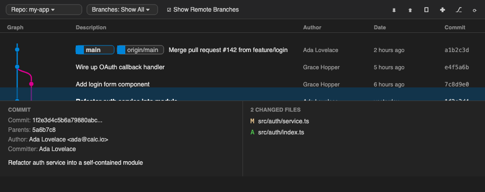
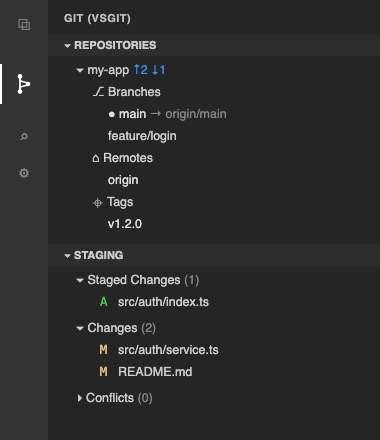

# VsGit — a full Git client for VS Code

VsGit is a complete, power-user Git client built into VS Code. It drives the real
`git` binary directly — no libgit2, no JavaScript reimplementation of git — and
surfaces **170+ commands** across every Git workflow through dedicated tree
views, rich webviews, an interactive commit graph, and native Source Control
integration.

Because every operation is a genuine `git` invocation with an argv array, VsGit
behaves *exactly* like your shell: the same config, hooks, credential helpers,
aliases, and `.gitignore` rules apply. Nothing is approximated.



> The images in this README are static **illustrations** of the interface (the
> graph is rendered exactly this way from live repository data); they are not
> live screenshots of a running editor.

---

## Table of contents

- [Why VsGit](#why-vsgit)
- [Feature highlights](#feature-highlights)
- [Screenshots](#screenshots)
- [Views & panels](#views--panels)
  - [Activity-bar container](#activity-bar-container)
  - [Repositories view](#repositories-view)
  - [Commit webview](#commit-webview)
  - [Git Graph](#git-graph)
  - [History view](#history-view)
  - [Compare view](#compare-view)
  - [Synchronize view](#synchronize-view)
  - [Conflict resolution](#conflict-resolution)
  - [Reflog view](#reflog-view)
  - [Worktrees view](#worktrees-view)
- [Native Source Control integration](#native-source-control-integration)
- [Advanced operations](#advanced-operations)
- [File & language icons](#file--language-icons)
- [Keyboard shortcuts](#keyboard-shortcuts)
- [Getting started](#getting-started)
- [Settings reference](#settings-reference)
- [Architecture](#architecture)
- [Security model](#security-model)
- [Development & testing](#development--testing)
- [Requirements](#requirements)
- [FAQ & troubleshooting](#faq--troubleshooting)
- [License](#license)

---

## Why VsGit

VS Code ships with a capable Source Control panel, but power users coming from
Eclipse's EGit, `gitk`, `git-cola`, GitKraken, or standalone graph tools often
want more than commit/push/pull: a real commit graph, worktrees, interactive
rebase, LFS, notes, bisect, subtree, Gerrit, submodules, and per-commit
operations — all without dropping to a terminal.

VsGit fills that gap by driving the real `git` CLI:

- **Authentic behaviour.** Every operation is a real `git` command, so results
  match your shell precisely — including hooks, credential helpers, and aliases.
- **Breadth.** 170+ commands spanning the everyday flow and the long tail
  (rebase, LFS, notes, bisect, subtree, archive, patch, Gerrit, maintenance).
- **Multi-root aware.** Every view understands multi-folder workspaces and tracks
  a single "active repository" so the panels stay coherent.
- **Safe by construction.** Git is never spawned through a shell; refs and remote
  URLs from untrusted surfaces are guarded against option injection; the
  credential/editor IPC channels are authenticated with a per-session token.

## Feature highlights

- 🌳 **Interactive commit graph** — an SVG-rendered DAG with colour-coded branch
  lanes, inline ref pills, an expand-in-place commit-details row, flow tracing,
  fuzzy find, toggleable metadata columns, and a full right-click action menu.
- 📜 **History view** — a paginated log rendered with the *same* verified graph
  layout, with branch/author/message/date filtering and a Compare-Branches mode.
- ✍️ **Commit webview** — a Source-Control-style panel with a split **Commit /
  Commit & Push / Commit & Sync** button, amend / sign-off / GPG options behind a
  "more" menu, collapsible Staged/Changes groups, hunk-level staging, and a
  tree-or-list file view.
- 🗂️ **Rich sidebar** — Repositories, Commit, Staging, Synchronize, Conflicts,
  Reflog, Worktrees, and Compare, all multi-root aware.
- 🔁 **Native Source Control integration** — VsGit publishes real SCM resource
  groups (staged / working tree / merge) so VS Code's built-in Source Control
  panel gets VsGit's menus, quick-diff gutters, and commit input.
- 🎨 **Real VS Code icons** — the UI uses official VS Code **codicons**
  throughout, and file rows show the same **Seti file-type icons** you see in the
  Explorer (no hand-drawn SVGs).
- 🔧 **Everything else** — interactive rebase, LFS, notes, bisect, subtree,
  archive, patch, Gerrit, submodules, maintenance, blame, tags, and a graphical
  git-config editor.
- 🔒 **Hardened** — argv-only spawning, option-injection guards, and authenticated
  IPC for credential prompts and rebase/commit editing.

## Screenshots

### Git Graph panel


Colour-coded lanes, `HEAD → main` / remote / tag ref pills, a selected-row
commit-details panel (metadata on the left, changed files on the right), and
Eclipse-Git-style columns: **Graph · Description · Author · Authored Date ·
Committer · Committed Date · Commit**. Metadata columns are toggleable from the
graph toolbar; Authored Date and Committer are hidden by default.

### Activity bar & trees



The VsGit activity-bar container hosts the Repositories, Commit, and Staging
trees, among others, and follows the active repository selection.

---

## Views & panels

### Activity-bar container

A dedicated **VsGit** container in the activity bar groups all of the extension's
views. The core views (Repositories, Commit, Git Repositories) are always
visible; the advanced views (Staging, Reflog, Synchronize, Worktrees, Conflicts,
Compare) appear when `vsgit.showAdvancedViews` is enabled.

### Repositories view

- Multi-root workspace support with per-repo ahead/behind indicators.
- A full tree of branches, remotes, tags, stashes, submodules, and worktrees.
- Inline checkout, push, pull, fetch, merge, and rebase directly from tree nodes.
- **Reset HEAD** submenu with all five git modes — soft, mixed, hard, keep, and
  merge — each picking the target ref and confirming before a destructive reset.
- **Switch To** quick picker (`⌘⇧G B` / `Ctrl+Shift+G B`) across all branches
  and tags.
- Sequencer controls (Continue / Skip / Abort) appear automatically during an
  in-progress rebase, merge, cherry-pick, or revert.
- Selecting a repository here makes it the **active repository**; the Commit,
  Staging, Synchronize, Reflog, History, and Graph surfaces all follow it.

### Commit webview

A Source-Control-style commit panel that replaces the transient input box:

- **Branch header** showing the current branch with a branch glyph.
- **Split Commit button** with a dropdown of commit actions, mirroring VS Code's
  Source Control panel:
  - **Commit** — commit staged changes (the primary action persists your last
    choice).
  - **Commit & Push** — commit, then push to the upstream.
  - **Commit & Sync** — commit, then pull and push.
  - **Commit (Amend)** — amend the previous commit (message prefilled).
  - **Commit (Signed Off)** — add a `Signed-off-by` trailer (DCO).
- A **"more" (`…`) menu** revealing **Amend**, **Sign off**, and **GPG** toggles;
  an indicator dot stays on the toggle whenever one is active, so an enabled
  option is never silently hidden.
- **Collapsible groups** — *Staged Changes*, *Changes*, and *Conflicts* sections
  each collapse/expand (state persisted), with stage-all / unstage-all actions.
- **Tree or flat list** file view (toggle persisted across sessions), with the
  real Explorer file icon, a per-file status code, and inline
  stage / unstage / discard actions.
- **Hunk-level staging** — stage and unstage individual hunks (forward/reverse
  patch apply against the index).
- `Ctrl/Cmd+Enter` commits, matching the native SCM input.

### Git Graph

- **SVG-rendered commit graph**: one overlay path system spanning every row, so
  branch edges never break apart between rows.
- **Inline ref labels**, an **expand-at-selection** commit-details row, and
  `Ctrl/Cmd-click` to **compare any two commits**.
- **Flow tracing** — highlight the ancestors and/or descendants of the selected
  commit; the Trace toolbar button cycles **off → ancestors → both** and shows
  its current mode as a label.
- **Find** (`Ctrl/Cmd+F`) across commit message, author, hash, and ref names.
- **Toggleable metadata columns** (Id / Author / Authored Date / Committer /
  Committed Date) from the toolbar.
- **Toolbar**: a Repo and Branches picker, a *Show Remote Branches* toggle, the
  Trace control, per-repo Pull / Push / Fetch (with ahead/behind badges),
  Commit / Branch / Merge / Stash, Find, Columns, Tracking, and Refresh — plus an
  in-progress operation banner.
- **Right-click** any commit or ref pill for the full action menu (checkout,
  branch, tag, merge, rebase, cherry-pick, revert, drop, reset, compare, copy
  SHA; branch/tag/stash management on ref pills).

### History view

- A paginated commit log (page size configurable) rendered with the shared,
  unit-tested graph layout — branch lanes stay connected across rows.
- Filter by **branch**, **author**, or **message**; restrict by **date range**.
- Per-commit context menu: checkout (detached), create branch/tag, cherry-pick,
  revert, reset (soft / mixed / hard / keep / merge), compare with HEAD or another
  commit, copy SHA, and show full details.
- **Compare Branches** mode for a symmetric `A...B` diff.
- Commits load in `--topo-order` so a child always precedes its parents — required
  for the lane layout to draw a correct graph.

### Compare view

- Side-by-side branch/ref comparison tree listing the commits unique to each side
  and all changed files; click a file to open a diff.

### Synchronize view

- Incoming (behind) and outgoing (ahead) commits vs the configured upstream;
  right-click to cherry-pick or checkout any incoming commit.

### Conflict resolution

- The Conflicts view lists every conflicted file with **Use Ours / Use Theirs /
  Open Merge Editor / Mark Resolved**, backed by VS Code's built-in 3-way merge
  editor.

### Reflog view

- Browse `git reflog` and checkout or reset to any entry — your safety net for
  recovering lost commits.

### Worktrees view

- List, create, open, lock, unlock, remove, and prune linked worktrees.

---

## Native Source Control integration

VsGit doesn't just live in its own container — it also publishes real
`vscode.SourceControl` resource groups for **staged**, **working-tree**, and
**merge** changes. That means the built-in Source Control panel shows VsGit's
inline menus, supports quick-diff gutters, and routes commit-message input
through VsGit. A `vsgit:` content provider feeds VS Code's diff editor with the
correct blobs for any ref or index state.

---

## Advanced operations

| Feature | What you get |
|---|---|
| **Interactive Rebase** | Drag-and-drop todo editor with reword / squash / fixup / drop, edited entirely inside VS Code |
| **Worktrees** | Create, open, lock, unlock, remove, prune |
| **Git LFS** | Track, untrack, lock, unlock, list locks, pull, prune |
| **Git Notes** | Add, edit, remove, show per-commit notes |
| **Bisect** | Start, mark good/bad, reset, show log |
| **Subtree** | Add, pull, push, split |
| **Submodules** | Add, update, sync, deinit |
| **Archive** | Create a zip/tar from any ref |
| **Patch** | Create from staged changes or commits, and apply patch files |
| **Gerrit** | Push for review, install the `Change-Id` commit-msg hook |
| **Maintenance** | `git gc`, prune, fsck, and repo maintenance helpers |
| **Blame** | Toggleable inline blame annotations (`⌘⇧G A`) |
| **Tags** | Webview **Create Tag** dialog — name, message, and annotate / sign / force / push options in one form |
| **GitHub** | Fetch Pull Requests — pulls `refs/pull/*/head` as local refs |
| **Stash** | Save, apply, pop, drop, and inspect stashes |
| **Remotes** | Add, remove, rename, edit URL, prune |
| **Git Config editor** | A graphical editor (`⌘⇧G ,`) for local / global / system git config |

Interactive rebase and commit-message editing are routed back into VS Code via a
small editor shim wired to `GIT_SEQUENCE_EDITOR` / `GIT_EDITOR`, so `git rebase
-i` opens a native editor instead of a terminal `vi` session.

---

## File & language icons

VsGit uses **official VS Code codicons** for every UI glyph (toolbar buttons, ref
pills, tree chevrons, actions) — there are no hand-drawn or third-party SVG icons
in the interface.

For changed-file rows in the Commit and Graph panels, VsGit shows the same
**Seti file-type icons** that VS Code's default File Icon Theme renders in the
Explorer (colourful, language-specific icons for JS/TS/JSON/Python/etc.).

> **Why bundle the icons?** Webviews can't read the user's active File Icon Theme
> ([microsoft/vscode#183893](https://github.com/microsoft/vscode/issues/183893)).
> VsGit therefore bundles the Seti icon font and a filename→icon mapping
> generated from VS Code's own `theme-seti` source — the same approach GitLens
> uses. The icons match stock VS Code; they won't follow a *custom* third-party
> icon theme.

---

## Keyboard shortcuts

| macOS | Windows / Linux | Command |
|---|---|---|
| `⌘⇧G C` | `Ctrl+Shift+G C` | Commit |
| `⌘⇧G P` | `Ctrl+Shift+G P` | Push |
| `⌘⇧G L` | `Ctrl+Shift+G L` | Show History |
| `⌘⇧G F` | `Ctrl+Shift+G F` | Fetch |
| `⌘⇧G B` | `Ctrl+Shift+G B` | Switch To Branch/Tag |
| `⌘⇧G A` | `Ctrl+Shift+G A` | Toggle Inline Blame |
| `⌘⇧G G` | `Ctrl+Shift+G G` | Show Git Graph |
| `⌘⇧G K` | `Ctrl+Shift+G K` | Cherry-Pick Commit |
| `⌘⇧G ,` | `Ctrl+Shift+G ,` | Open Git Config Panel |

All 170+ commands are also available from the Command Palette under the
**Git (VsGit)** category.

---

## Getting started

VsGit isn't published to the Marketplace yet; build and install it from source.

```bash
git clone https://github.com/ajaykontham/git-vscode
cd git-vscode
npm install
npm run build                 # bundle the extension into dist/
npx vsce package --no-dependencies -o vsgit.vsix
code --install-extension vsgit.vsix
```

Or run it live in the **Extension Development Host**: open the folder in VS Code,
run `npm run watch`, then press `F5`.

Once installed, click the **VsGit** icon in the activity bar, or run
**Git (VsGit): Show Git Graph** from the Command Palette.

---

## Settings reference

All 29 settings live under the `vsgit.*` namespace.

### General

| Setting | Default | Description |
|---|---|---|
| `vsgit.showAdvancedViews` | `false` | Show advanced sidebar sections (Staging, Reflog, Synchronize, Worktrees, Conflicts, Compare). |
| `vsgit.git.path` | `""` | Custom path to the `git` executable; empty uses `$PATH`. |
| `vsgit.autoRefresh` | `true` | Refresh views automatically when the repo changes. |
| `vsgit.confirmDestructiveActions` | `true` | Confirm hard reset, clean, force-push, etc. |
| `vsgit.showCommandPreview` | `false` | Preview mutating git commands before execution; read-only refresh/diff commands run without prompting. |
| `vsgit.defaultPullMode` | `merge` | Pull strategy: `merge` or `rebase`. |

### Fetch & sync

| Setting | Default | Description |
|---|---|---|
| `vsgit.autoFetch.enabled` | `false` | Periodically fetch from all remotes. |
| `vsgit.autoFetch.intervalMinutes` | `3` | Minutes between automatic fetches. |
| `vsgit.autoFetch.notify` | `true` | Notify when auto-fetch discovers new incoming commits. |
| `vsgit.fetch.pruneOnFetch` | `true` | Prune deleted remote-tracking branches on fetch. |

### Commit & blame

| Setting | Default | Description |
|---|---|---|
| `vsgit.commit.gpgSign` | `false` | Sign commits with GPG by default (`-S`). |
| `vsgit.commit.signOff` | `false` | Add a `Signed-off-by` trailer by default (DCO). |
| `vsgit.blame.enabledByDefault` | `false` | Show inline blame when opening files. |

### History & graph

| Setting | Default | Description |
|---|---|---|
| `vsgit.history.maxCommits` | `500` | Max commits to load in the History view. |
| `vsgit.graph.pageSize` | `200` | Commits loaded per page in the History view. |
| `vsgit.graph.maxCommits` | `500` | Max commits to load in the Git Graph. |
| `vsgit.graph.sortOrder` | `date` | Commit sort order for the History view. |
| `vsgit.graph.style` | `rounded` | Branch line style: `rounded` curves or `angular` elbows. |
| `vsgit.graph.colours` | 12-colour palette | Branch lane colours cycled through in the graph. |
| `vsgit.graph.dateFormat` | `standard` | Date format in the graph (`relative` / `iso` / `standard`). |
| `vsgit.graph.showRemoteBranches` | `true` | Show remote branches in the graph by default. |
| `vsgit.graph.showSidebar` | `true` | Show the graph's left sidebar tree. |
| `vsgit.graph.showStatusBarItem` | `true` | Show a *Git Graph* button in the status bar. |
| `vsgit.graph.bottomPanelMode` | `editor` | How the graph opens a changed file's diff. |
| `vsgit.graph.showIdColumn` | `true` | Show the Id (hash) column. |
| `vsgit.graph.showAuthorColumn` | `true` | Show the Author column. |
| `vsgit.graph.showAuthoredDateColumn` | `false` | Show the Authored Date column. |
| `vsgit.graph.showCommitterColumn` | `false` | Show the Committer column. |
| `vsgit.graph.showCommittedDateColumn` | `true` | Show the Committed Date column. |

There's also a graphical **Git Config editor** (`⌘⇧G ,`) for editing local /
global / system git config, and a Remotes manager.

---

## Architecture

```
src/
  extension.ts            activation: registers commands, views, providers
  git/
    GitExecutor.ts        the ONLY place git is spawned (argv array, no shell)
    Repository.ts         per-repo cached state + all git operations
    RepositoryManager.ts  multi-root discovery + change notifications
    GitContentProvider.ts vsgit: URIs that feed VS Code's diff editor
    argGuard.ts           option-injection guards (safeRef / safeRemoteUrl)
    parsers/              pure, unit-tested output parsers
                          (log, graphLog, status, refs, diff, blame, config,
                           reflog, rebaseTodo, worktree)
  commands/               one module per workflow (branch, stash, tag, lfs,
                          notes, bisect, subtree, rebase, gerrit, …)
  views/                  tree data providers + native Source Control bridge
  webviews/               webview panels (Graph, History, Commit, Create Tag,
                          pickers)
  services/               auto-fetch, file-system watcher, status bar
  util/                   IPC servers (askpass / editor) + helpers (html escape)
resources/
  graph.js / graph.css    Git Graph panel client
  graphLayout.js          shared, unit-tested commit-graph layout (UMD)
  commit.js / commit.css  Commit webview client
  commitView.js           Commit view pure helpers (UMD, unit-tested)
  setiIcons.js            shared filename→Seti-icon resolver (UMD)
  seti.css / seti.woff    bundled Seti file-icon font (Explorer icons)
  codicon.css / codicon.ttf  bundled VS Code codicon font (UI glyphs)
  askpass.js              GIT_ASKPASS shim
  sequence-editor.js      GIT_SEQUENCE_EDITOR / GIT_EDITOR shim
  icon.svg                activity-bar logo
```

Key design points:

- **One spawn site.** Every git call funnels through `GitExecutor`, which uses
  `child_process.spawn(gitPath, args)` with an argv array — never a shell string.
- **Machine-readable output.** Operations request NUL-/porcelain-formatted output
  and parse it in small, pure functions under `git/parsers/`, each with tests.
- **One graph layout.** Both the Git Graph panel and the History view import the
  same `resources/graphLayout.js` (a UMD module that also loads in Node), so there
  is a single, verified implementation of lane layout and edge geometry.
- **Shared webview helpers.** Pure logic (status labels, file-tree grouping,
  HTML-escaping, Seti icon resolution) lives in UMD modules so it can be unit
  tested in Node and reused across the Commit and Graph webviews.
- **Live refresh.** A file-system watcher plus `RepositoryManager.onDidChange`
  keep every view in sync after internal or external git changes.

## Security model

- **No shell.** Git is spawned with an argv array, so shell metacharacters
  (`;`, `|`, `$()`, backticks) are inert.
- **Option-injection guards.** Refs, SHAs, branch names, and remote URLs coming
  from webview messages or rendered commit data are validated by `safeRef` /
  `safeRemoteUrl`: values beginning with `-` (which git would parse as options)
  are rejected, as are the `ext::` / `fd::` remote-helper transports that can run
  arbitrary commands.
- **Authenticated IPC.** Credential prompts (`GIT_ASKPASS`) and rebase/commit
  editing run over a unix socket / named pipe whose name is enumerable by other
  local processes. Each session generates a random token, passed to the shim only
  via its environment; the server rejects any connection that doesn't echo it —
  preventing local credential phishing or edit injection. Credential prompts are
  masked unless they explicitly ask for a username, and the IPC read buffers are
  bounded.
- **Strict webview CSP.** Each webview runs under a Content-Security-Policy that
  only allows the extension's own nonce'd scripts and bundled styles/fonts.

## Development & testing

```bash
npm install
npm run watch        # esbuild in watch mode; F5 launches the dev host
npm run check-types  # tsc --noEmit
npm run build        # production bundle into dist/
npm test             # compile + run the unit-test suite
```

### Testing

Tests run on Node's built-in test runner (`node --test`) — no VS Code instance
required. They cover the pure logic that's most worth pinning down:

- every output parser under `src/git/parsers/` (log, graph-log, status, refs,
  diff, blame, config, reflog, rebase-todo, worktree),
- the shared commit-graph layout (`resources/graphLayout.test.js`) and the Git
  Graph / Commit webview clients (`resources/manifest.test.js`,
  `resources/commit.test.js`, `resources/commitView.test.js`),
- the Seti filename→icon resolver,
- the `GitExecutor` argv assembly and the `Repository` command builders,
- the argument guards, the HTML-escape helper, and the IPC token comparison.

```bash
npm test     # 172 tests
```

CI (GitHub Actions) runs type-check, build, the test suite, and packages the VSIX
on every push and pull request.

---

## Requirements

- VS Code **1.85+**
- `git` **2.20+** on `$PATH` (or set `vsgit.git.path`)
- `git-lfs` for the LFS commands (optional)

## FAQ & troubleshooting

**VsGit can't find my repository.** VsGit discovers repos from your open
workspace folders. Make sure the folder containing `.git` is open, or run
**Git (VsGit): Refresh**.

**Git isn't found / wrong version.** Set `vsgit.git.path` to the absolute path of
your `git` binary, then reload the window.

**The advanced views are missing.** Enable `vsgit.showAdvancedViews` to reveal
Staging, Reflog, Synchronize, Worktrees, Conflicts, and Compare.

**File icons look generic.** VsGit shows the default Seti icons; it cannot read a
custom File Icon Theme inside a webview (a VS Code platform limitation). The icons
will match a stock VS Code install.

**Credential prompts.** VsGit uses your existing git credential helper via
`GIT_ASKPASS`. If a remote needs auth, you'll get a native VS Code prompt.

## License

[MIT](LICENSE)
