<div align="center">


<br/>

<h1>VsGit — a full Git client for VS Code</h1>

<p><b>A complete, power-user Git client built into VS Code, driving the real <code>git</code> binary directly.</b></p>

<p>
Interactive commit graph &nbsp;&middot;&nbsp; Interactive rebase &nbsp;&middot;&nbsp; Worktrees &nbsp;&middot;&nbsp; LFS &nbsp;&middot;&nbsp; Gerrit &nbsp;&middot;&nbsp; Bisect &nbsp;&middot;&nbsp; Submodules &nbsp;&middot;&nbsp; Subtree<br />
Native Source Control integration &nbsp;&middot;&nbsp; 173 commands across every Git workflow<br />
No libgit2, no JavaScript reimplementation of git — every operation is a genuine <code>git</code> invocation.
</p>

<p>
<a href="https://marketplace.visualstudio.com/items?itemName=framedparadox.vsgit-vscode"></a>
<a href="https://marketplace.visualstudio.com/items?itemName=framedparadox.vsgit-vscode"></a>
<a href="https://marketplace.visualstudio.com/items?itemName=framedparadox.vsgit-vscode"></a>
</p>

<p>
<a href="https://open-vsx.org/extension/framedparadox/vsgit-vscode"></a>
<a href="https://open-vsx.org/extension/framedparadox/vsgit-vscode"></a>
<a href="https://github.com/framedparadox/vsgit-vscode/blob/main/LICENSE"></a>

</p>

<p>
<a href="https://marketplace.visualstudio.com/items?itemName=framedparadox.vsgit-vscode"><b>Install from the Marketplace</b></a>
&nbsp;&middot;&nbsp;
<a href="https://open-vsx.org/extension/framedparadox/vsgit-vscode">Install from Open VSX</a>
&nbsp;&middot;&nbsp;
<a href="#getting-started">Getting started</a>
&nbsp;&middot;&nbsp;
<a href="#common-workflows">Workflows</a>
&nbsp;&middot;&nbsp;
<a href="https://github.com/framedparadox/vsgit-vscode/issues">Report an issue</a>
</p>

</div>

---

Because every operation is a genuine `git` invocation with an argv array, VsGit
behaves *exactly* like your shell: the same config, hooks, credential helpers,
aliases, and `.gitignore` rules apply. Nothing is approximated.

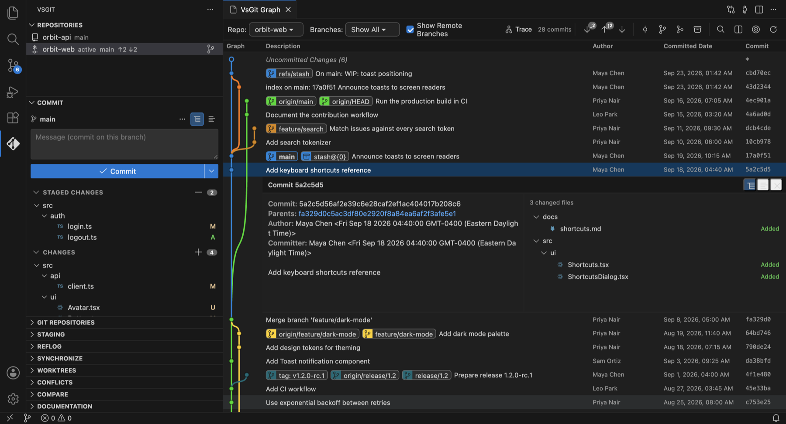

> **About the screenshots.** Every image in this README is a real capture of
> VsGit 0.0.8 running in VS Code 1.126 (Default Dark Modern theme). They were
> taken against a two-repository demo workspace (`orbit-web` and `orbit-api`)
> with fictional contributors, so branch names, authors, and commit messages
> are sample data.

---

## Table of contents

- [Why VsGit](#why-vsgit)
- [Feature highlights](#feature-highlights)
- [Screenshot tour](#screenshot-tour)
- [Getting started](#getting-started)
- [The VsGit sidebar](#the-vsgit-sidebar)
  - [Repositories](#repositories)
  - [Git Repositories tree](#git-repositories-tree)
  - [Commit](#commit)
  - [Staging](#staging)
  - [Synchronize](#synchronize)
  - [Reflog](#reflog)
  - [Worktrees](#worktrees)
  - [Conflicts](#conflicts)
  - [Compare](#compare)
  - [Documentation](#documentation-view)
- [Git Graph](#git-graph)
- [History](#history)
- [Native Source Control integration](#native-source-control-integration)
- [Editor and Explorer integration](#editor-and-explorer-integration)
- [Dialogs and editors](#dialogs-and-editors)
  - [Interactive rebase](#interactive-rebase)
  - [Create Tag](#create-tag)
  - [Git Config editor](#git-config-editor)
  - [Branch, tag, and commit pickers](#branch-tag-and-commit-pickers)
- [Documentation library](#documentation-library)
- [Common workflows](#common-workflows)
- [Advanced operations](#advanced-operations)
- [Command reference](#command-reference)
- [Keyboard shortcuts](#keyboard-shortcuts)
- [Settings reference](#settings-reference)
- [File & language icons](#file--language-icons)
- [What's included and what's next](#whats-included-and-whats-next)
- [Architecture](#architecture)
- [Security model](#security-model)
- [Development & testing](#development--testing)
- [Requirements](#requirements)
- [FAQ & troubleshooting](#faq--troubleshooting)
- [License](#license)

---

## Why VsGit

VS Code ships with a capable Source Control panel, but power users coming from
Eclipse's EGit, `gitk`, `git-cola`, GitKraken, or standalone graph tools often
want more than commit/push/pull: a real commit graph, worktrees, interactive
rebase, LFS, notes, bisect, subtree, Gerrit, submodules, and per-commit
operations — all without dropping to a terminal.

VsGit fills that gap by driving the real `git` CLI:

- **Authentic behaviour.** Every operation is a real `git` command, so results
  match your shell precisely — including hooks, credential helpers, and aliases.
- **Breadth.** 173 commands spanning the everyday flow and the long tail
  (rebase, LFS, notes, bisect, subtree, archive, patch, Gerrit, maintenance).
- **Multi-root aware.** Every view understands multi-folder workspaces and tracks
  a single "active repository" so the panels stay coherent.
- **Familiar to EGit users.** Team, Compare With, and Replace With menus, a
  reference picker with Local / Remote Tracking / Tags / References sections,
  and a Git Graph with Eclipse-style columns.
- **Safe by construction.** Git is never spawned through a shell; refs and remote
  URLs from untrusted surfaces are guarded against option injection; the
  credential/editor IPC channels are authenticated with a per-session token.

---

## Feature highlights

| Feature | What you get |
|---|---|
| 🌳 **Interactive commit graph** | An SVG-rendered DAG with colour-coded branch lanes, inline ref pills, an expand-in-place commit-details row, flow tracing, fuzzy find, toggleable metadata columns, and a full right-click action menu. |
| 📜 **History view** | A searchable commit log with ref badges, message/author filtering, an all-branches toggle, per-commit details, and a Compare-Branches mode. |
| ✍️ **Commit webview** | A Source-Control-style panel with a split **Commit / Commit & Push / Commit & Sync** button, amend / sign-off / GPG options behind a "more" menu, collapsible Staged/Changes groups, hunk-level staging, and a tree-or-list file view. |
| 🗂️ **Rich sidebar** | Repositories, Commit, Git Repositories, Staging, Synchronize, Conflicts, Reflog, Worktrees, and Compare, all multi-root aware. |
| 🔁 **Native Source Control integration** | VsGit publishes real SCM resource groups (staged / working tree / merge) so VS Code's built-in Source Control panel gets VsGit's menus, quick-diff gutters, and commit input. |
| 🧭 **Team menus everywhere** | Compare With, Replace With, and Team submenus on Explorer files and editors, plus EGit-style branch/tag/reference and commit pickers. |
| 🎨 **Real VS Code icons** | The UI uses official VS Code **codicons** throughout, and file rows show the same **Seti file-type icons** you see in the Explorer (no hand-drawn SVGs). |
| 🔧 **Everything else** | Interactive rebase, LFS, notes, bisect, subtree, archive, patch, Gerrit, submodules, maintenance, blame, tags, and a graphical git-config editor. |
| 📚 **Built-in documentation library** | A searchable bottom sidebar view and full editor screen explaining every VsGit component, key Git terminology, and all contributed operations with their purpose and entry point. |
| 🔒 **Hardened** | Argv-only spawning, option-injection guards, and authenticated IPC for credential prompts and rebase/commit editing. |

---

## Screenshot tour

A quick look at the main surfaces. Each one is described in detail further down.

<table>
<tr>
<td width="50%" valign="top"><a href="#git-graph">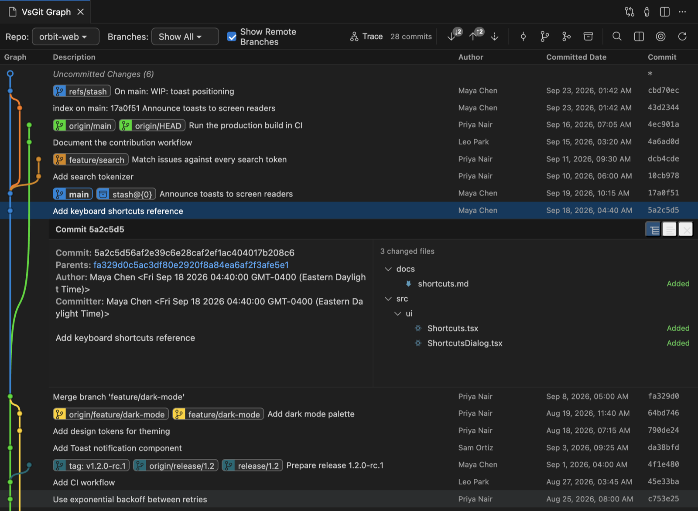</a><br/><sub><b>Git Graph</b> — lanes, ref pills, inline commit details</sub></td>
<td width="50%" valign="top"><a href="#history">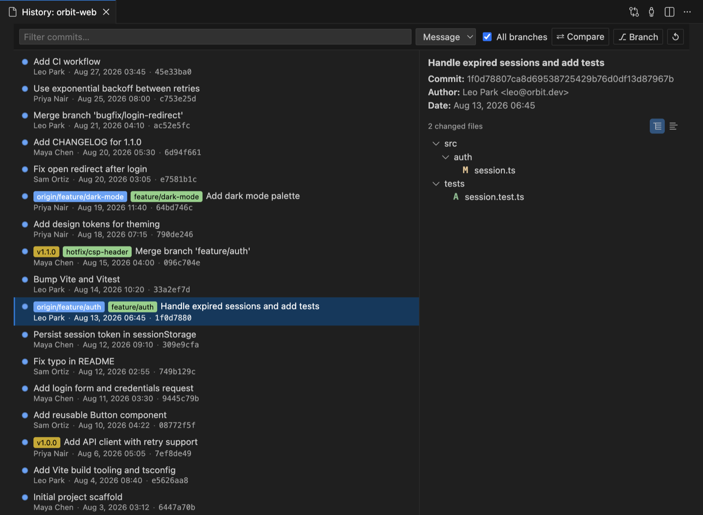</a><br/><sub><b>History</b> — filterable log with commit details</sub></td>
</tr>
<tr>
<td width="50%" valign="top"><a href="#interactive-rebase">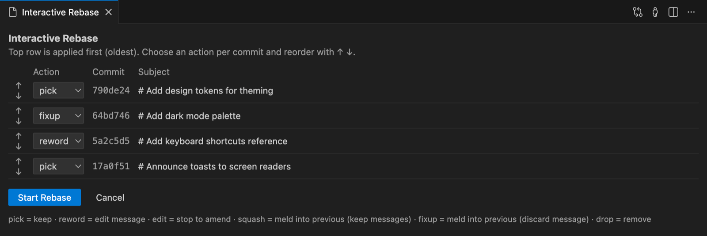</a><br/><sub><b>Interactive rebase</b> — edit the todo list in a form</sub></td>
<td width="50%" valign="top"><a href="#conflicts">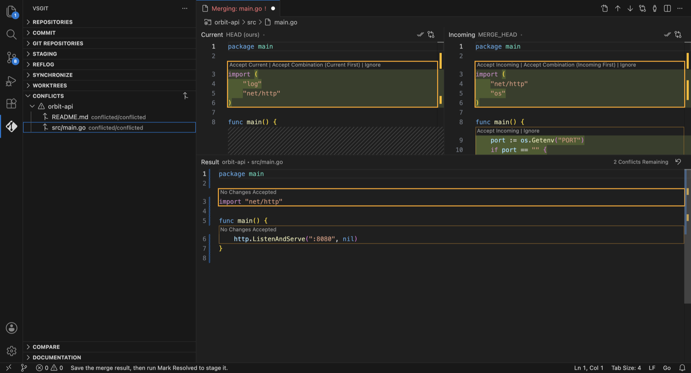</a><br/><sub><b>Conflicts</b> — straight into the 3-way merge editor</sub></td>
</tr>
<tr>
<td width="50%" valign="top"><a href="#native-source-control-integration">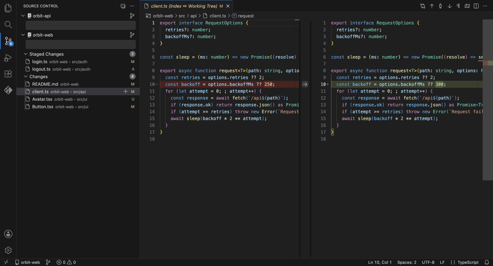</a><br/><sub><b>Native Source Control</b> — VsGit groups and diffs</sub></td>
<td width="50%" valign="top"><a href="#documentation-library">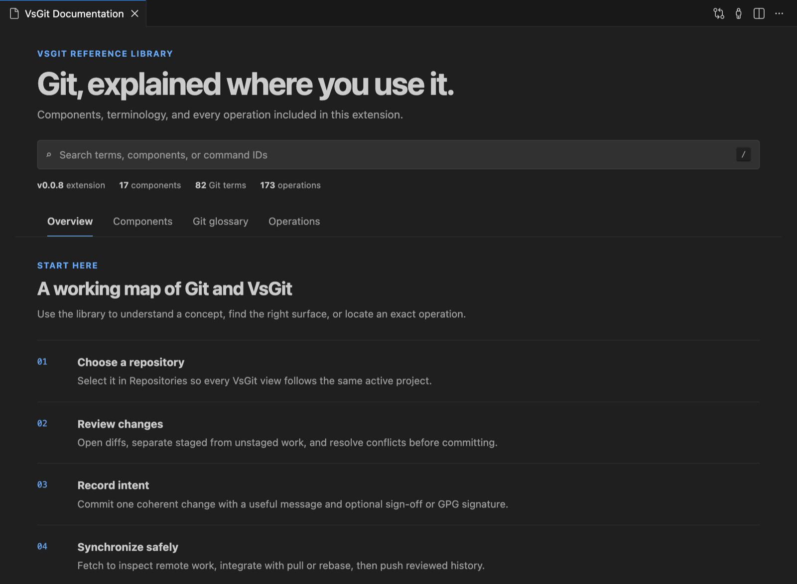</a><br/><sub><b>Documentation library</b> — components, glossary, operations</sub></td>
</tr>
</table>

---

## Getting started

### 1. Install

Pick whichever suits your editor:

| Source | How |
|---|---|
| [VS Code Marketplace](https://marketplace.visualstudio.com/items?itemName=framedparadox.vsgit-vscode) | Extensions (`Ctrl+Shift+X` / `Cmd+Shift+X`) → search **VsGit** → **Install** |
| Command line | `code --install-extension framedparadox.vsgit-vscode` |
| [Open VSX](https://open-vsx.org/extension/framedparadox/vsgit-vscode) | For VSCodium, Gitpod, Eclipse Theia and other non-Microsoft builds |
| [GitHub Releases](https://github.com/framedparadox/vsgit-vscode/releases) | Download the `.vsix` → **Extensions → ⋯ → Install from VSIX…** |

### 2. Open a repository

1. Open a folder (or a multi-root workspace) that contains a Git repository.
   If there is none yet, the Repositories view offers **Clone Repository**,
   **Initialize Repository**, and **Refresh** buttons.
2. Trust the workspace when VS Code asks. VsGit is disabled in Restricted Mode
   because Git runs the repository's hooks and configuration.
3. Click the **VsGit** icon in the activity bar.

### 3. Pick the active repository

Click a repository in the **Repositories** view. It is marked **active**, and
the Commit, Staging, Synchronize, Reflog, History, and Graph surfaces all follow
it. Commands run from a context menu use the repository you right-clicked;
palette commands use the repository of the file in the active editor, and ask
you to choose when that is ambiguous.

### 4. Turn on the advanced views (optional)

Staging, Reflog, Synchronize, Worktrees, Conflicts, and Compare are hidden until
you enable `vsgit.showAdvancedViews`:

```jsonc
// settings.json
{
  "vsgit.showAdvancedViews": true
}
```

### 5. Explore

- Press `⌘⇧G G` / `Ctrl+Shift+G G` to open the **Git Graph**.
- Type **VsGit** in the Command Palette to see the 72 palette commands.
- Right-click repositories, branches, tags, commits, and files for the rest.
- Open **Documentation** at the bottom of the VsGit sidebar for the built-in
  reference.

<details>
<summary><b>Build from source</b></summary>

```bash
git clone https://github.com/framedparadox/vsgit-vscode.git
cd vsgit-vscode
npm install
npm run build                 # bundle the extension into dist/
npx vsce package --no-dependencies -o vsgit.vsix
code --install-extension vsgit.vsix
```

Or run it live in the **Extension Development Host**: open the folder in VS Code,
run `npm run watch`, then press `F5`.

</details>

---

## The VsGit sidebar

<table>
<tr>
<td width="44%" valign="top">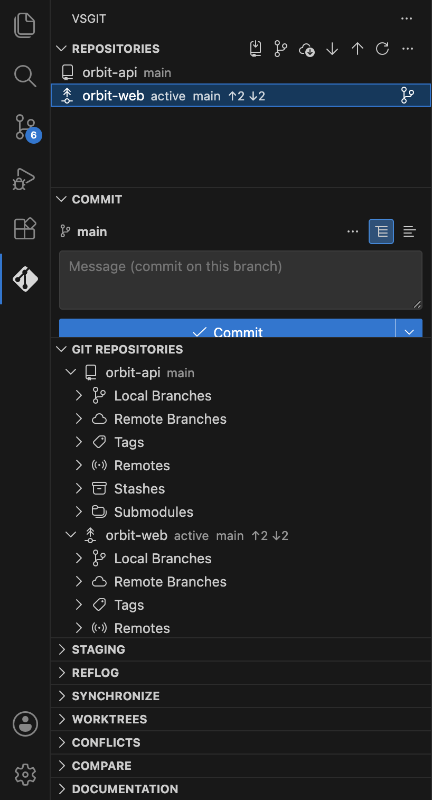</td>
<td valign="top">

A dedicated **VsGit** container in the activity bar holds every view:

| View | Shown | Purpose |
|---|---|---|
| Repositories | Always | Pick the active repository; ahead/behind counts |
| Commit | Always | Write messages, stage, and commit |
| Git Repositories | Always | Branches, remotes, tags, stashes, submodules |
| Staging | Advanced | Staged and unstaged files as a tree view |
| Reflog | Advanced | Every HEAD movement, for recovery |
| Synchronize | Advanced | Incoming and outgoing commits |
| Worktrees | Advanced | Linked working directories |
| Conflicts | Advanced | Conflicted files during merge/rebase |
| Compare | Advanced | Branch/tag comparison results |
| Documentation | Always | Searchable reference library |

The core views are always visible. Documentation stays at the bottom and works
without a repository. The advanced views appear when
`vsgit.showAdvancedViews` is enabled. Every view is multi-root aware.

</td>
</tr>
</table>

### Repositories

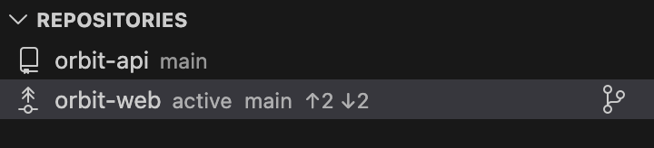

- Lists every repository in the workspace with its current branch and
  ahead/behind counts (`↑2 ↓2` means two commits to push and two to pull).
- Selecting a repository makes it the **active repository**; the Commit,
  Staging, Synchronize, Reflog, History, and Graph surfaces all follow it.
- Title-bar actions: Clone, Switch To, Fetch, Pull, Push, and Refresh. The `…`
  menu adds Show History, Fetch GitHub Pull Requests, Fetch All Remotes Now,
  Continue / Skip / Abort / Abort Merge, Compare Branches, Filter History by
  Branch, and Initialize Repository.
- Right-click a repository for the full **VsGit** menu:

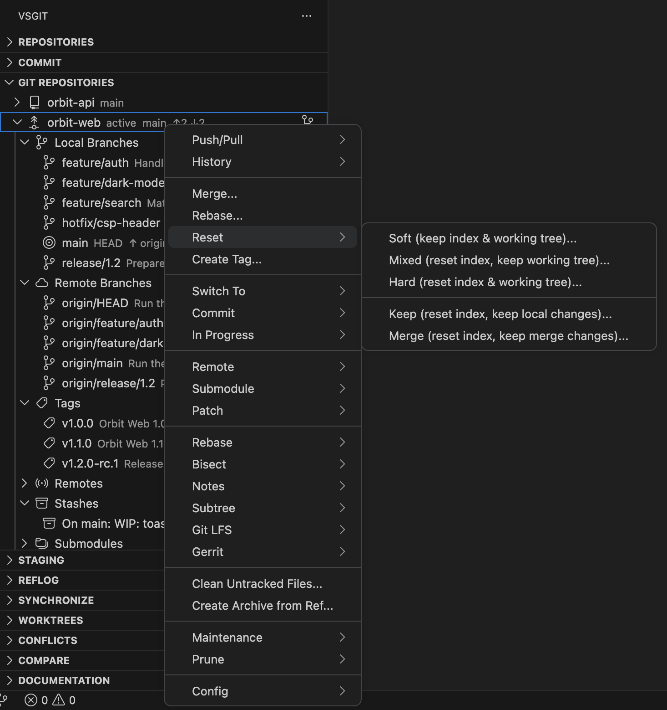

The **Reset** submenu exposes all five `git reset` modes — soft, mixed, hard,
keep, and merge. Each one asks for a target ref and confirms before a
destructive reset. **In Progress** holds the sequencer controls (Continue, Skip,
Abort) during a rebase, merge, cherry-pick, or revert.

### Git Repositories tree

<table>
<tr>
<td width="50%" valign="top">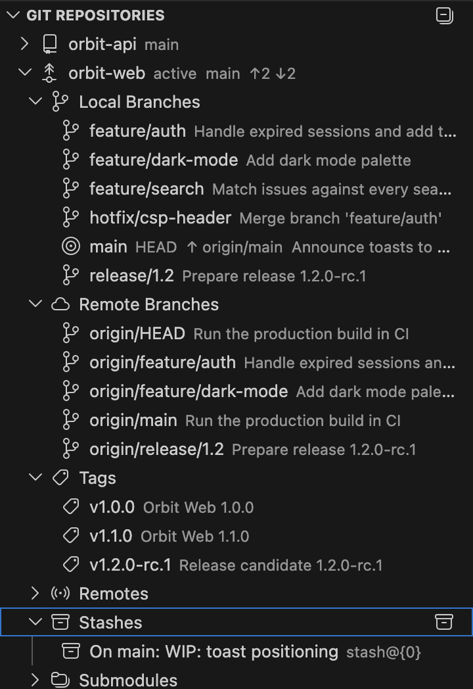</td>
<td width="50%" valign="top">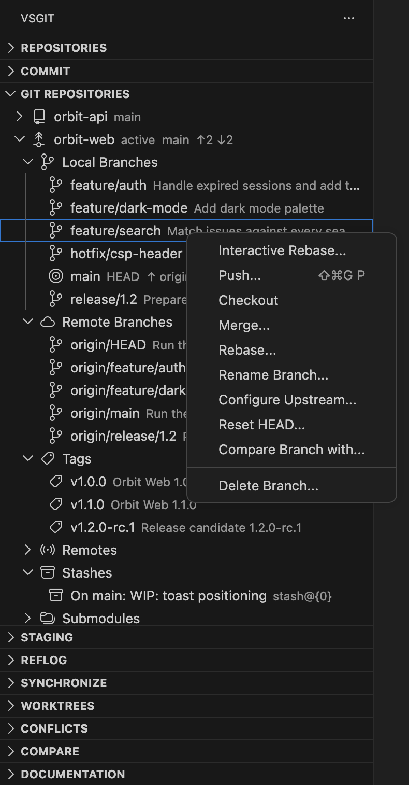</td>
</tr>
</table>

- A full tree per repository: **Local Branches**, **Remote Branches**, **Tags**,
  **Remotes**, **Stashes**, and **Submodules** (submodules load lazily when
  expanded).
- Branch rows show the tip commit subject; the current branch is marked
  `HEAD` with its upstream (`↑ origin/main`). Annotated tags show their message.
- Branch actions: Interactive Rebase, Push, Checkout, Merge, Rebase, Rename,
  Configure Upstream, Reset HEAD, Compare Branch with, and Delete.
- Remote branches: Checkout (creates a tracking branch) and Delete Remote Branch.
- Tags: Checkout, Push, Delete, Delete Remote Tag, and Force Re-tag.
- Stashes: Apply, Pop, Drop, View Stash Contents, and Create Branch from Stash.
- **Switch To** quick picker (`⌘⇧G B` / `Ctrl+Shift+G B`) across all branches
  and tags.

### Commit

<table>
<tr>
<td width="50%" valign="top">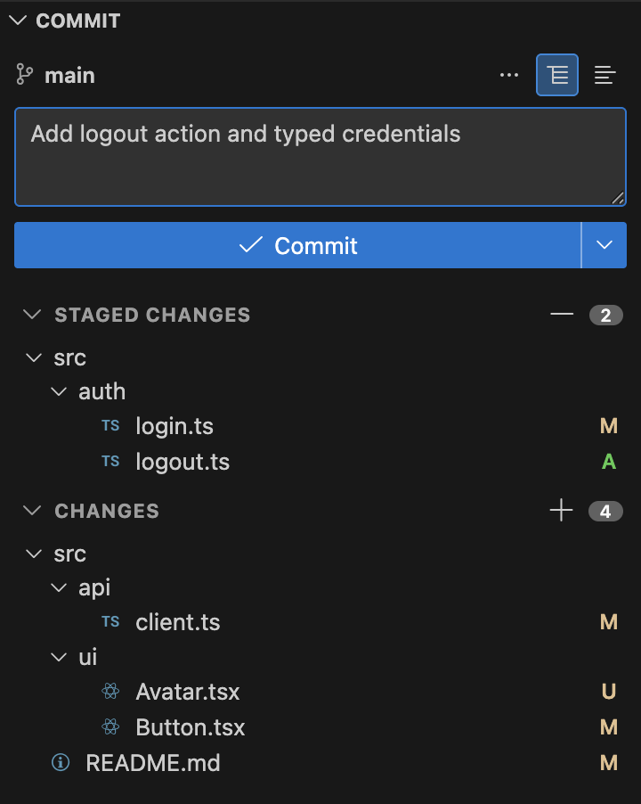<br/><sub>Tree layout with staged and unstaged groups</sub></td>
<td width="50%" valign="top">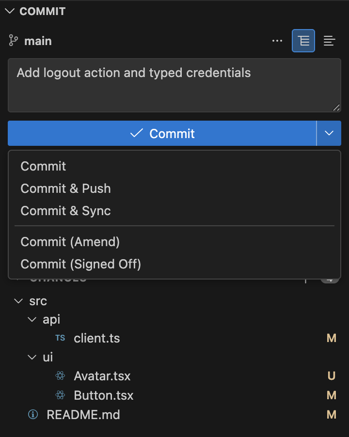<br/><sub>Split-button commit actions</sub></td>
</tr>
<tr>
<td width="50%" valign="top">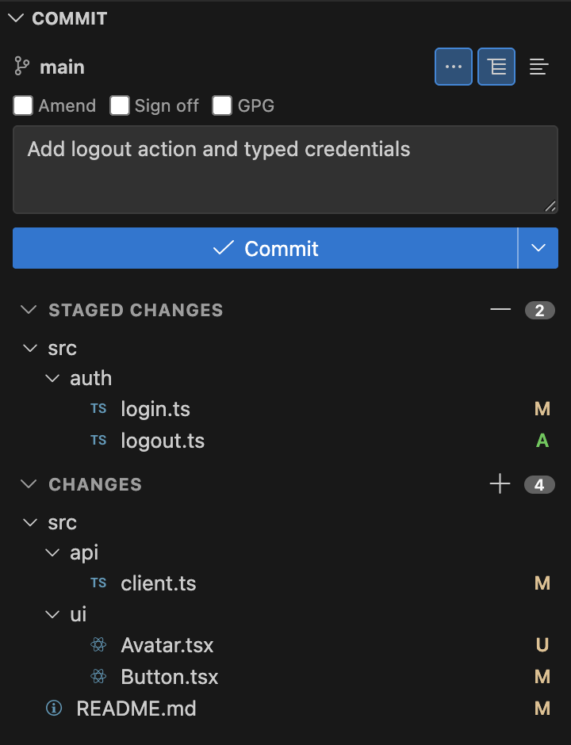<br/><sub>Amend / Sign off / GPG toggles</sub></td>
<td width="50%" valign="top">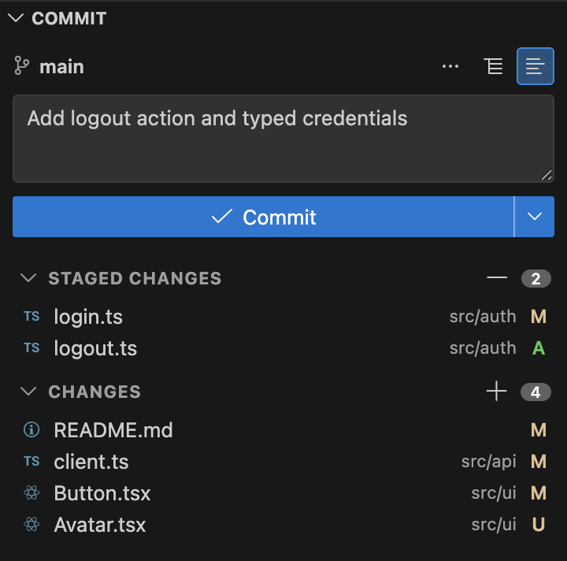<br/><sub>Flat list layout</sub></td>
</tr>
</table>

A Source-Control-style commit panel that replaces the transient input box:

- **Branch header** showing the current branch with a branch glyph.
- **Split Commit button** with a dropdown of commit actions, mirroring VS Code's
  Source Control panel:
  - **Commit** — commit staged changes (the primary action persists your last
    choice).
  - **Commit & Push** — commit, then push to the upstream.
  - **Commit & Sync** — commit, then pull and push.
  - **Commit (Amend)** — amend the previous commit (message prefilled).
  - **Commit (Signed Off)** — add a `Signed-off-by` trailer (DCO).
- A **"more" (`…`) menu** revealing **Amend**, **Sign off**, and **GPG** toggles;
  an indicator dot stays on the toggle whenever one is active, so an enabled
  option is never silently hidden.
- **Collapsible groups** — *Staged Changes*, *Changes*, and *Conflicts* sections
  each collapse/expand (state persisted), with stage-all / unstage-all actions.
- **Tree or flat list** file view (toggle persisted across sessions), with the
  real Explorer file icon, a per-file status code (`M`, `A`, `D`, `U`, `C`), and
  inline stage / unstage / discard actions.
- **Hunk-level staging** — stage and unstage individual hunks (forward/reverse
  patch apply against the index).
- `Ctrl/Cmd+Enter` commits, matching the native SCM input.

### Staging

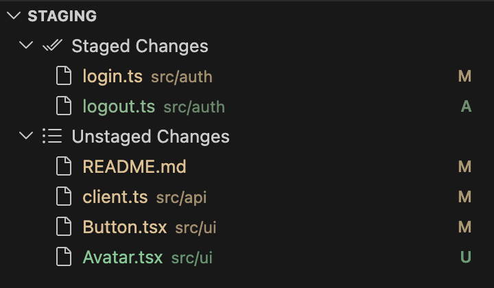

A tree-view alternative to the Commit webview. Right-click a file to **Stage**,
**Unstage**, **Stage Hunk(s)…**, **Unstage Hunk(s)…**, **Discard Changes**,
**Add to .gitignore**, or **Open Diff**. The title bar has Commit, Amend Last
Commit, Stage All, and Refresh.

### Synchronize

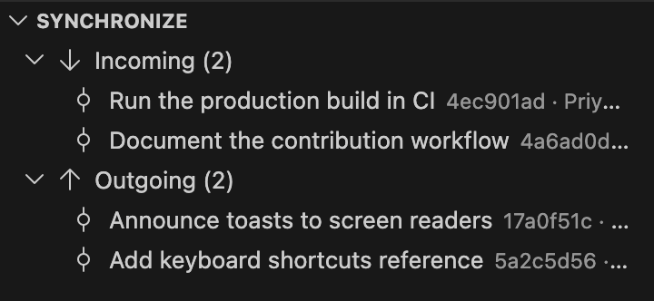

Incoming (behind) and outgoing (ahead) commits compared with the configured
upstream. Right-click an incoming commit to **Cherry-Pick Commit**, **Checkout
Commit (Detached)**, or **Show Commit Details**. Turn on
`vsgit.autoFetch.enabled` to keep the incoming side current in the background.

### Reflog

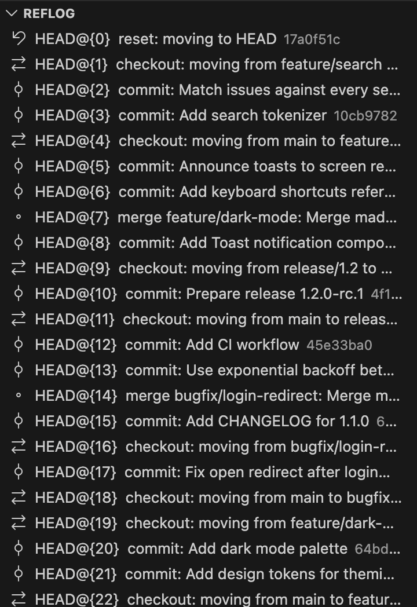

Browse `git reflog` and **Checkout This Entry** or **Reset HEAD to Entry…** — your
safety net for recovering commits after a reset, rebase, or deleted branch.

### Worktrees

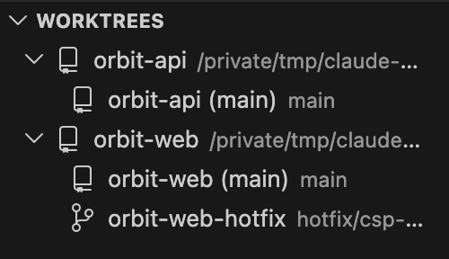

List, create (**Add Worktree…**), open in a new window or the current one, lock,
unlock, move, remove, prune, and reveal linked worktrees. Each entry shows its
checked-out branch or detached commit.

### Conflicts

<table>
<tr>
<td width="50%" valign="top">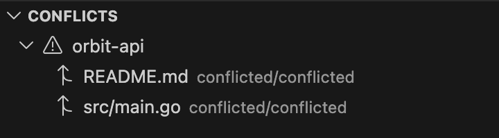<br/><br/>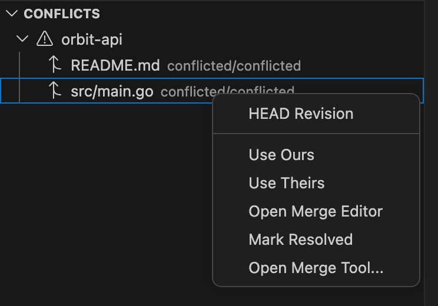</td>
<td width="50%" valign="top">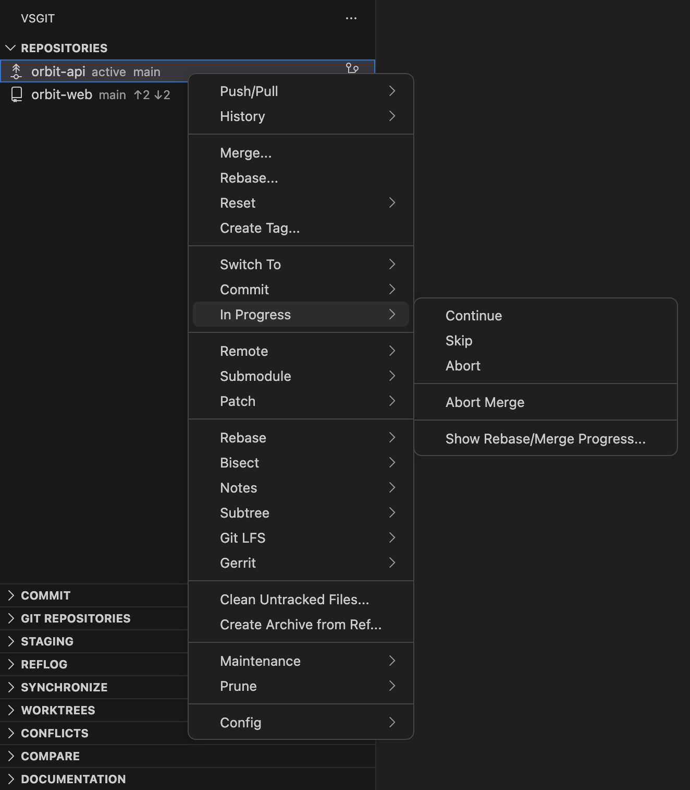</td>
</tr>
</table>

During a merge, rebase, cherry-pick, or revert the Conflicts view lists every
conflicted file with **Use Ours**, **Use Theirs**, **Open Merge Editor**, **Mark
Resolved**, **Open Merge Tool…** (your configured `git mergetool`), and **HEAD
Revision**. The view title bar opens the merge tool. The repository's **In
Progress** submenu, the Repositories view `…` menu, and the Git Graph banner
offer **Continue**, **Skip**, and **Abort**.

**Open Merge Editor** uses VS Code's built-in 3-way merge editor, with *Current
(HEAD, ours)* and *Incoming (MERGE_HEAD)* inputs:


### Compare

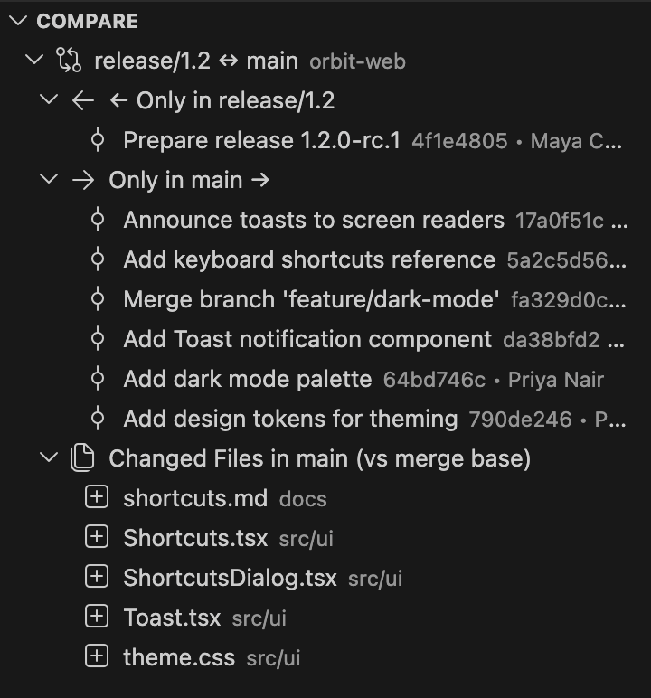

Run **VsGit: Start Branch/Tag Comparison…**, pick two refs, and the Compare view
lists the commits unique to each side plus every file changed since the merge
base. Click a file to open a diff. **Switch Comparison Sides** and **Clear
Comparison** are in the view title bar.

### Documentation view

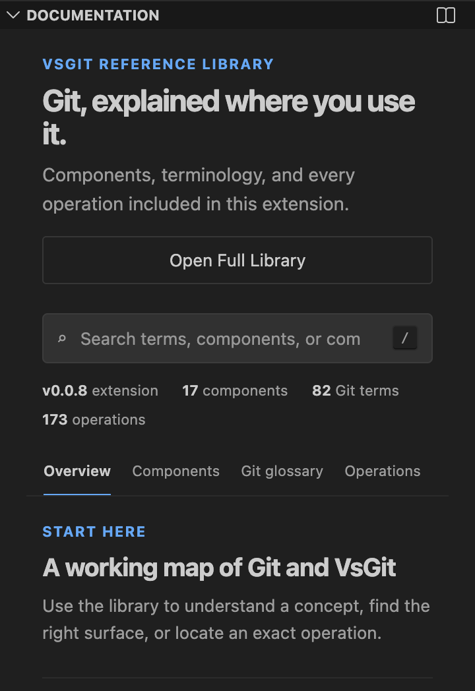

The Documentation view stays at the bottom of the VsGit sidebar and works
without an active repository. **Open Full Library** opens the wider editor
version — see [Documentation library](#documentation-library).

---

## Git Graph


Open it with `⌘⇧G G` / `Ctrl+Shift+G G`, **VsGit: Show Git Graph**, the *Git
Graph* status-bar button, or the Source Control title bar.

- **SVG-rendered commit graph**: one overlay path system spanning every row, so
  branch edges never break apart between rows. Choose `rounded` or `angular`
  lines and your own lane colours in settings.
- **Inline ref pills** for local branches, remote branches, tags, `HEAD`, and
  stashes. The row for uncommitted changes sits at the top.
- **Expand-at-selection details**: click a commit to open its metadata, parents
  (clickable), refs, message, and changed files (tree or list) inline. Click a
  file to open its diff.
- Eclipse-Git-style columns: **Graph · Description · Author · Authored Date ·
  Committer · Committed Date · Commit**. Authored Date and Committer are hidden
  by default.
- **Toolbar**: Repo and Branches pickers, a *Show Remote Branches* toggle,
  **Trace**, the commit count, Pull / Push (with behind/ahead badges) / Fetch,
  Commit / New Branch / Merge / Stash, Find, Columns, Tracking, and Refresh.

<table>
<tr>
<td width="50%" valign="top">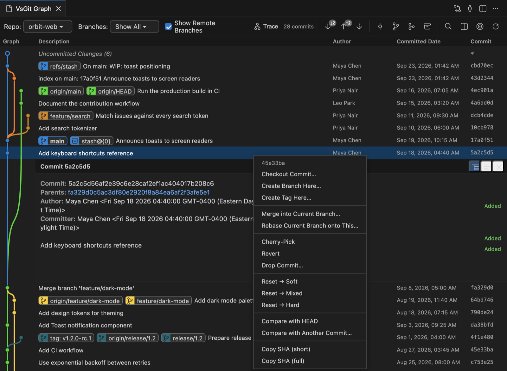<br/><sub><b>Commit menu</b> — checkout, branch, tag, merge, rebase, cherry-pick, revert, drop, reset, compare, copy SHA</sub></td>
<td width="50%" valign="top">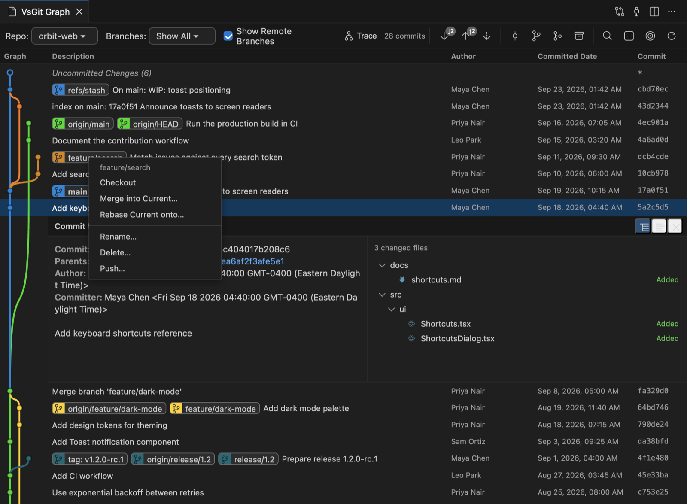<br/><sub><b>Ref pill menu</b> — checkout, merge, rebase onto, rename, delete, push</sub></td>
</tr>
<tr>
<td width="50%" valign="top">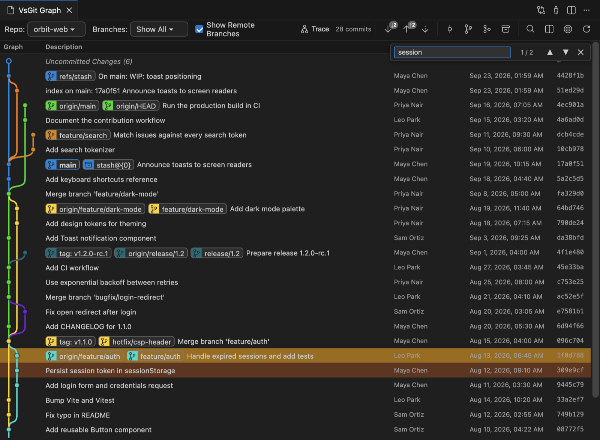<br/><sub><b>Find</b> (<code>Ctrl/Cmd+F</code>) across message, author, hash, and ref names</sub></td>
<td width="50%" valign="top">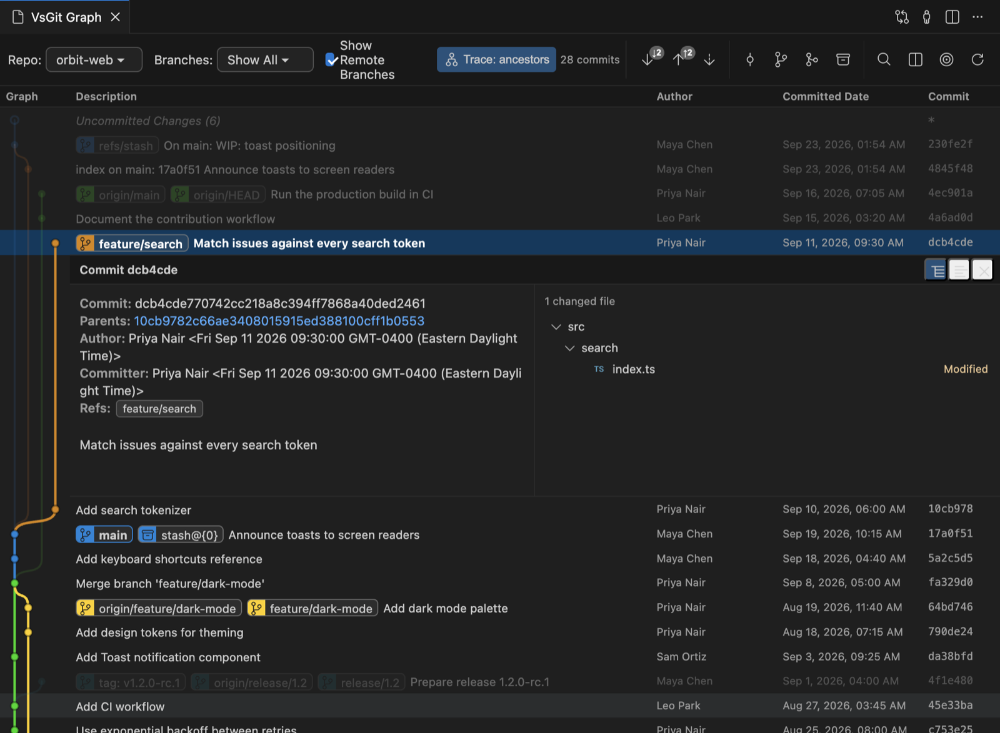<br/><sub><b>Trace</b> — dim everything except the ancestors (or ancestors and descendants)</sub></td>
</tr>
<tr>
<td width="50%" valign="top">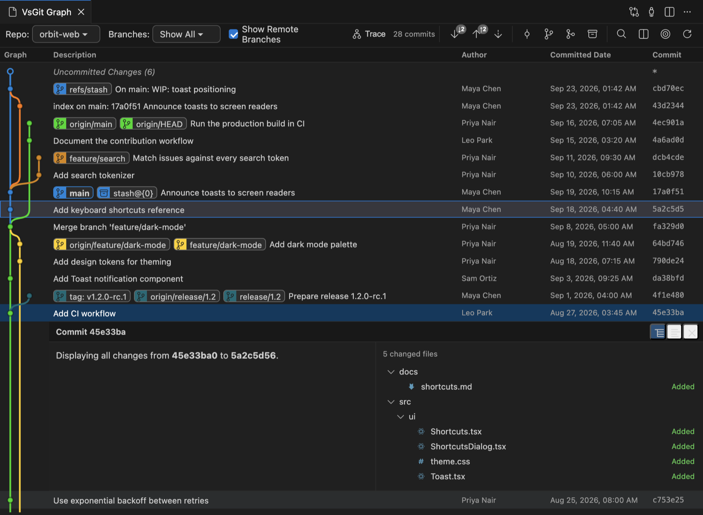<br/><sub><b>Compare</b> — <code>Ctrl/Cmd</code>-click a second commit</sub></td>
<td width="50%" valign="top">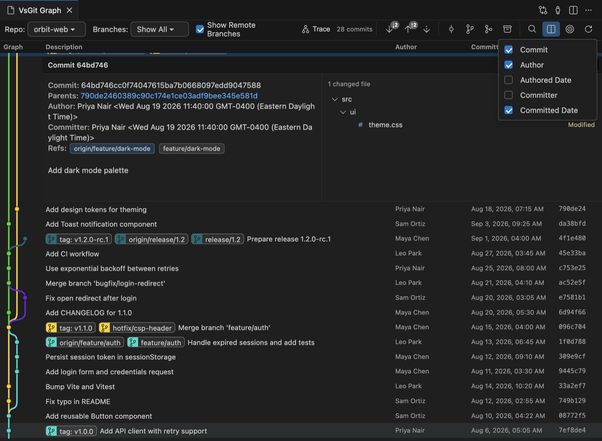<br/><sub><b>Columns</b> — toggle metadata columns</sub></td>
</tr>
<tr>
<td width="50%" valign="top">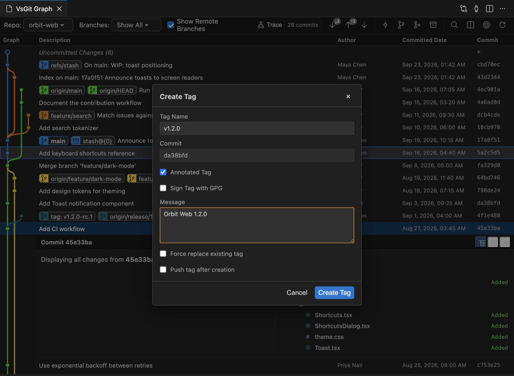<br/><sub><b>Create Tag Here</b> — annotated, signed, forced, or pushed</sub></td>
<td width="50%" valign="top">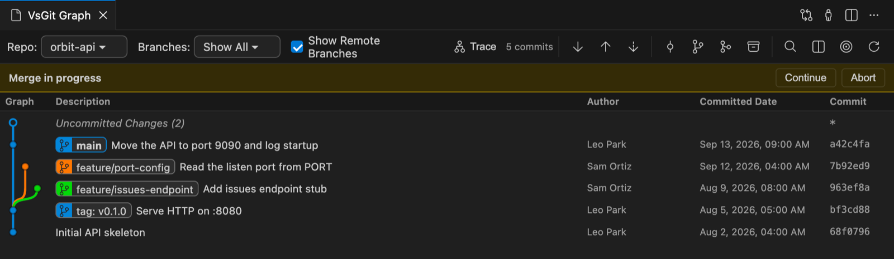<br/><sub><b>In-progress banner</b> — Continue / Skip / Abort</sub></td>
</tr>
</table>

| Interaction | What it does |
|---|---|
| Click a commit | Select it and expand its details row |
| `Ctrl/Cmd`-click a second commit | Show every change between the two commits |
| Right-click a commit, or `Shift+F10` | Commit action menu |
| Right-click a ref pill | Branch / tag / stash actions |
| `↑` / `↓`, `Home` / `End` | Move the selection |
| `Ctrl/Cmd+F`, then `Enter` / `Shift+Enter` / `Esc` | Find, next, previous, close |
| `Ctrl/Cmd+R` | Refresh |
| **Trace** button | Cycles **off → ancestors → both**; with trace on, clicking a ref pill re-roots the trace |
| **Tracking** button | Keeps the selection on a clicked ref pill across refreshes |
| Click a parent SHA in the details | Jump to that commit |

---

## History

<table>
<tr>
<td width="50%" valign="top"></td>
<td width="50%" valign="top">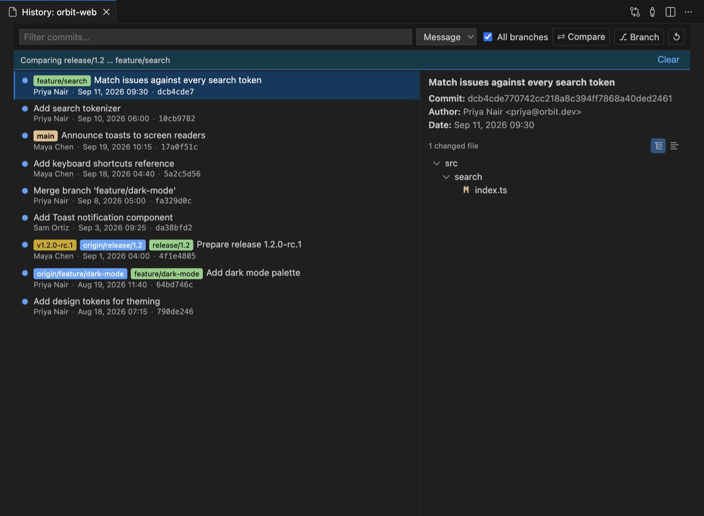</td>
</tr>
</table>

**VsGit: Show History** (`⌘⇧G L` / `Ctrl+Shift+G L`) opens a commit log in an
editor tab:

- Filter by **message** or **author** as you type, and switch between the
  current branch and **All branches**.
- Ref badges for branches, remote branches, and tags on each commit.
- Select a commit to see its hash, author, date, and changed files (tree or
  list); click a file for the diff.
- **Compare** (or **VsGit: Compare Branches…**) shows the commits in a
  symmetric `A...B` range, with a banner and **Clear** button.
- **Branch** (or **VsGit: Filter History by Branch…**) scopes the log to one
  branch.
- **Show File History** from the Explorer, editor, or Source Control menus opens
  the same view scoped to a single file.
- Per-commit actions: checkout (detached), create branch/tag, cherry-pick,
  revert, reset (soft / mixed / hard / keep / merge), compare with HEAD or
  another commit, copy SHA, and show full details.
- Commits load in `--topo-order` so a child always precedes its parents, and
  `vsgit.history.maxCommits` / `vsgit.graph.pageSize` bound how much is loaded.

---

## Native Source Control integration

<table>
<tr>
<td width="50%" valign="top">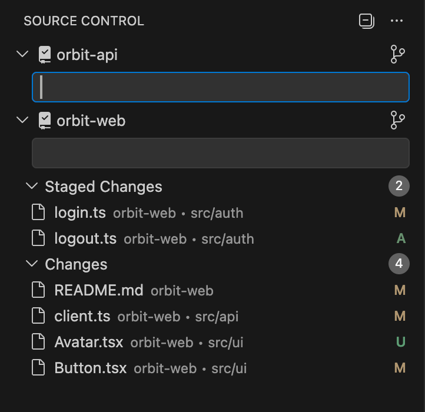</td>
<td width="50%" valign="top">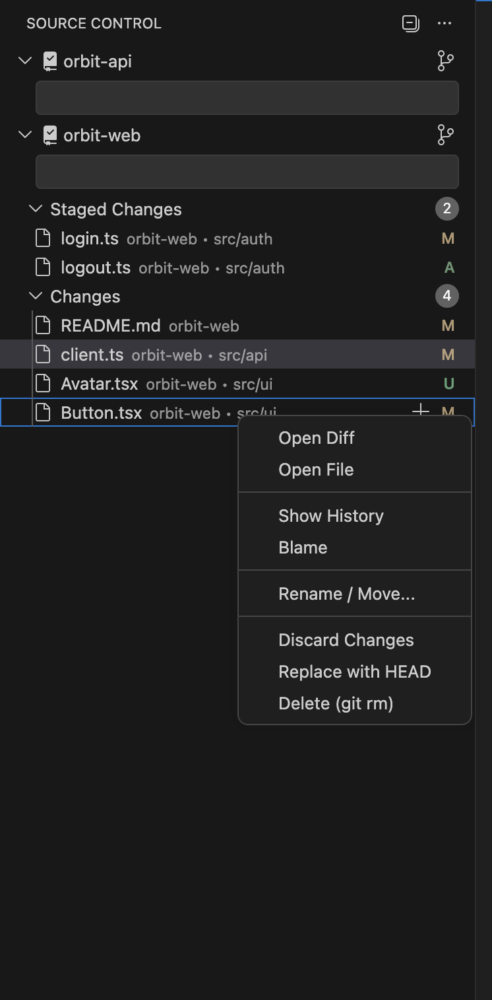</td>
</tr>
</table>

VsGit doesn't just live in its own container — it also publishes real
`vscode.SourceControl` resource groups for **staged**, **working-tree**, and
**merge** changes. That means the built-in Source Control panel shows VsGit's
inline menus, supports quick-diff gutters, and routes commit-message input
through VsGit. A `vsgit:` content provider feeds VS Code's diff editor with the
correct blobs for any ref or index state.


Resource actions include **Open Diff**, **Open File**, **Show History**,
**Blame**, **Rename / Move…**, **Discard Changes**, **Replace with HEAD**, and
**Delete (git rm)**, plus stage/unstage/discard-all on each group. The Source
Control title bar gets a **Show Git Graph** button.

> Tip: if you use VsGit as your only Git integration, set `"git.enabled": false`
> so the built-in Git provider doesn't show a second copy of each repository.

---

## Editor and Explorer integration

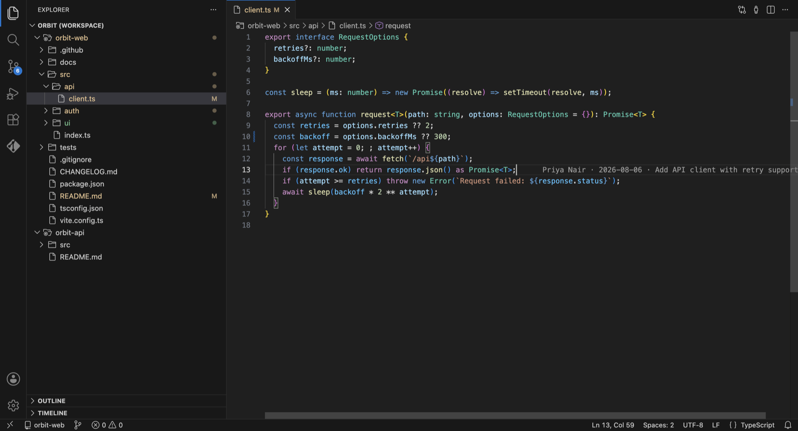

- **Inline blame** (`⌘⇧G A` / `Ctrl+Shift+G A`, or the editor title button)
  annotates the current line with author, date, and subject. Uncommitted lines
  read *You · Uncommitted changes*. Set `vsgit.blame.enabledByDefault` to turn
  it on for every file.
- **Quick-diff gutters** mark added, modified, and deleted lines against the
  index.
- **File decorations** colour changed files and folders in the Explorer.

<table>
<tr>
<td width="50%" valign="top">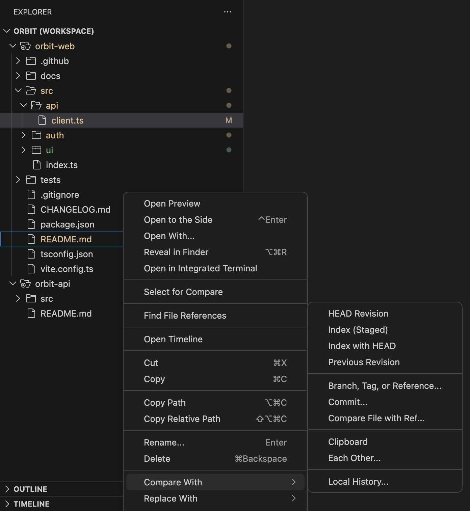<br/><sub><b>Compare With</b> — HEAD, Index, Previous Revision, a branch/tag/reference, a commit, the clipboard, each other, or local history</sub></td>
<td width="50%" valign="top">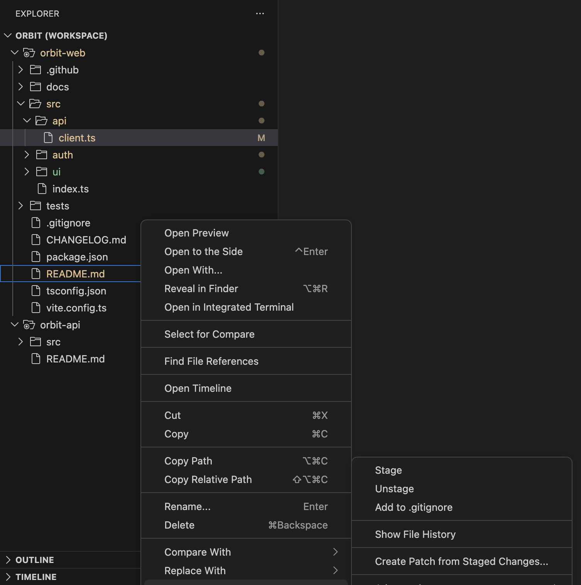<br/><sub><b>Team</b> — stage, unstage, ignore, file history, patch from staged changes, and an Advanced submenu</sub></td>
</tr>
</table>

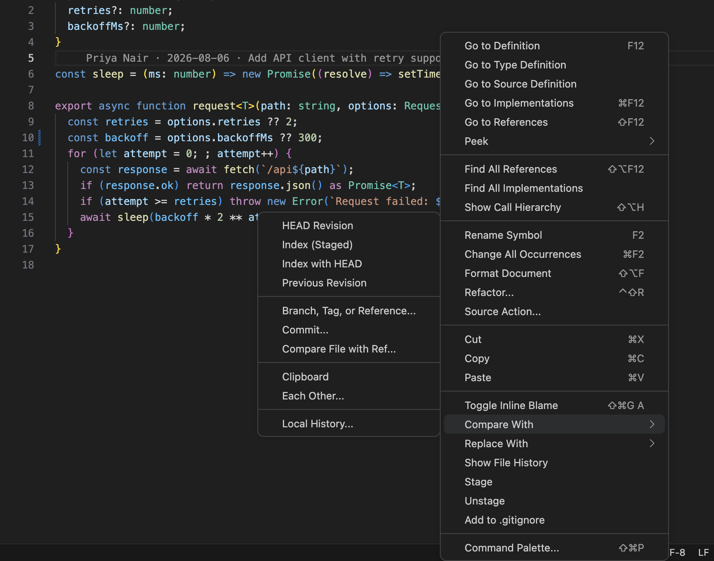

The same **Compare With** / **Replace With** submenus appear in the editor
context menu. **Replace With** restores a file from HEAD, the index, the
previous revision, a branch/tag/reference, a commit, or local history. **Team ›
Advanced** holds Assume Unchanged / No Assume Unchanged, Skip Worktree / No Skip
Worktree, Untrack (Remove from Index), and Clean Untracked Files.

---

## Dialogs and editors

### Interactive rebase


**VsGit: Interactive Rebase…** (or **Interactive Rebase…** on a branch) asks for
a base — a branch or "the last N commits" — and starts `git rebase -i`. The todo
list opens in a form instead of a terminal editor:

- Choose **pick**, **reword**, **edit**, **squash**, **fixup**, or **drop** per
  commit; dropped rows are struck through.
- Reorder with the ↑ / ↓ buttons. The top row is applied first.
- **Start Rebase** writes the todo; **Cancel** leaves the branch unchanged.
  Messages for reword and edit steps open in a VsGit text panel, not `vi`.

This works through a small editor shim wired to `GIT_SEQUENCE_EDITOR` /
`GIT_EDITOR` over authenticated IPC (see [Security model](#security-model)).

### Create Tag

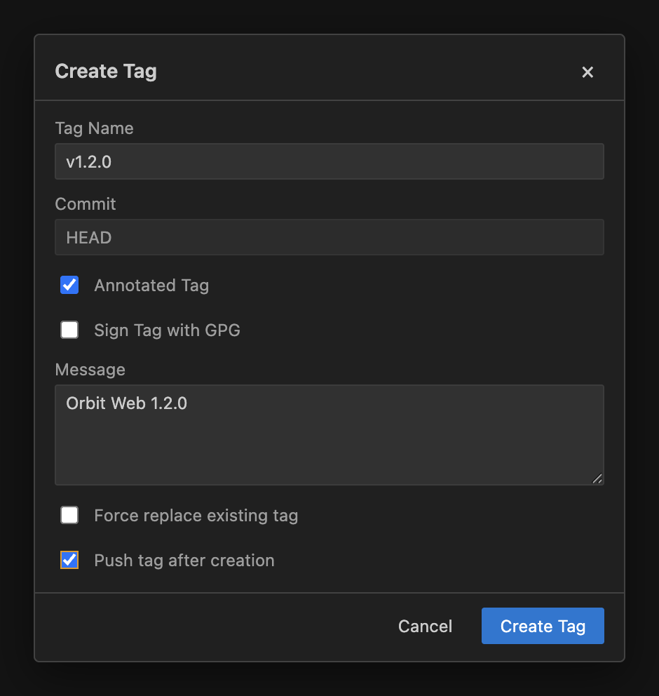

**VsGit: Create Tag…**, **Create Tag…** on a repository, or **Create Tag Here…**
in the graph opens one form for the name, target commit, message, and the
**Annotated**, **Sign with GPG**, **Force replace existing tag**, and **Push tag
after creation** options.

### Git Config editor

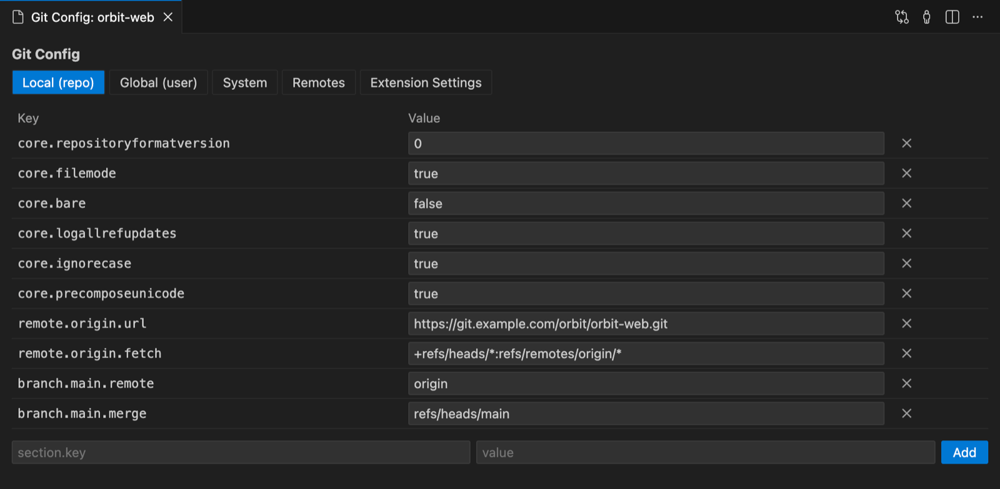

**VsGit: Open Git Config Panel…** (`⌘⇧G ,` / `Ctrl+Shift+G ,`) edits
configuration without memorising keys:

- **Local (repo)**, **Global (user)**, and **System** tabs list every key with an
  editable value, a delete button, and an **Add** row.
- **Remotes** manages remote names and fetch/push URLs (credentials embedded in
  URLs are redacted).
- **Extension Settings** exposes the most common VsGit settings.

<table>
<tr>
<td width="50%" valign="top">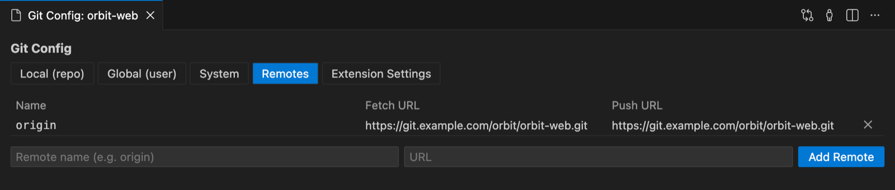</td>
<td width="50%" valign="top">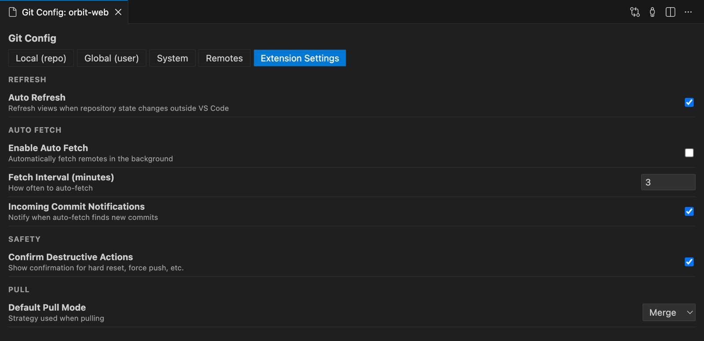</td>
</tr>
</table>

### Branch, tag, and commit pickers

<table>
<tr>
<td width="50%" valign="top">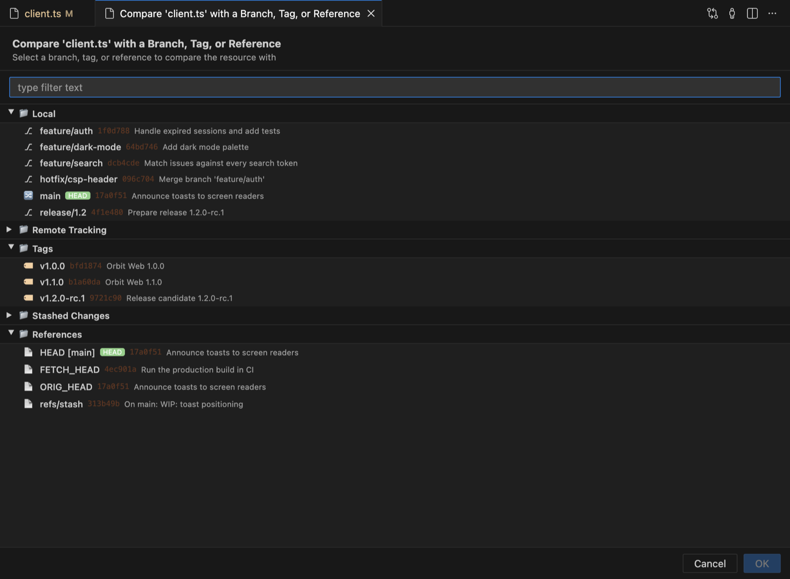<br/><sub><b>Reference picker</b> — used by Compare/Replace With › Branch, Tag, or Reference</sub></td>
<td width="50%" valign="top">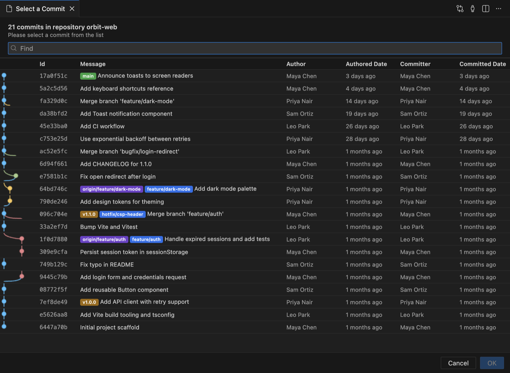<br/><sub><b>Commit picker</b> — used by Compare/Replace With › Commit</sub></td>
</tr>
<tr>
<td width="50%" valign="top">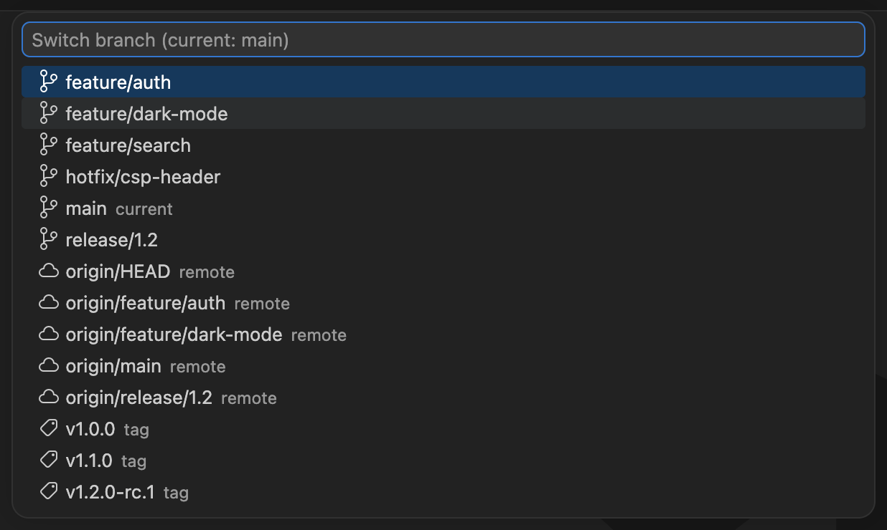<br/><sub><b>Switch To</b> (<code>⌘⇧G B</code>) — branches, remote branches, and tags</sub></td>
<td width="50%" valign="top">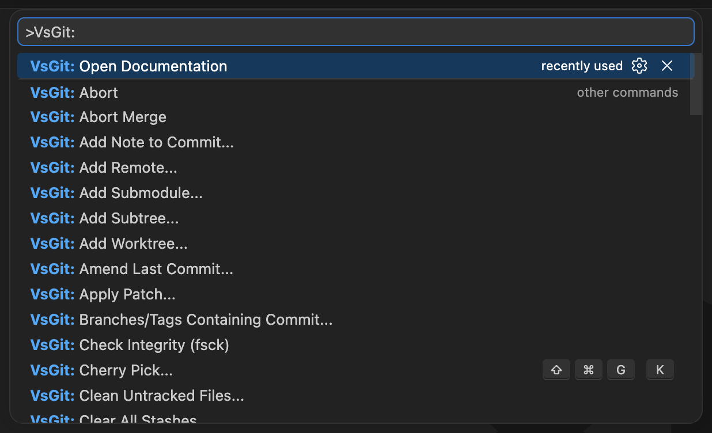<br/><sub><b>Command Palette</b> — 72 VsGit commands</sub></td>
</tr>
</table>

---

## Documentation library


Choose **Open Full Library** inside the sidebar view, use the view-title book
action, or run **VsGit: Open Documentation**. Press `/` to focus search and
`Escape` to clear it. The library has four sections:

- **Overview** — a safe daily workflow plus what was added and what remains
  planned.
- **Components** — what each of the 17 VsGit views and services is, its
  purpose, and how to use it.
- **Git glossary** — 82 Git terms with definitions, practical purpose,
  usage guidance, and recovery/destructive-operation cautions.
- **Operations** — all commands from the live extension manifest, grouped by
  workflow. Palette commands can be launched directly; context-only actions
  identify where their required selection is available.

<table>
<tr>
<td width="50%" valign="top">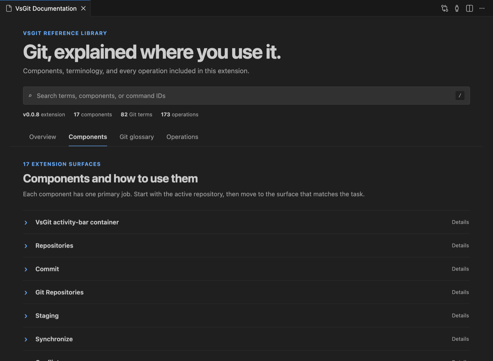<br/><sub>Components</sub></td>
<td width="50%" valign="top">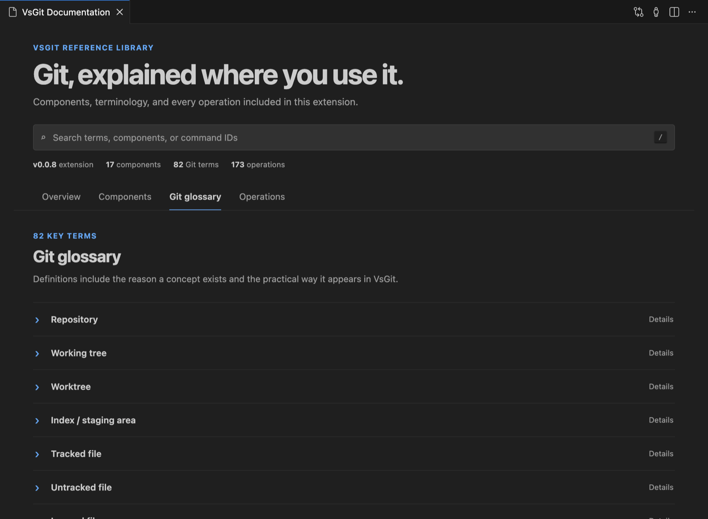<br/><sub>Git glossary</sub></td>
</tr>
<tr>
<td width="50%" valign="top">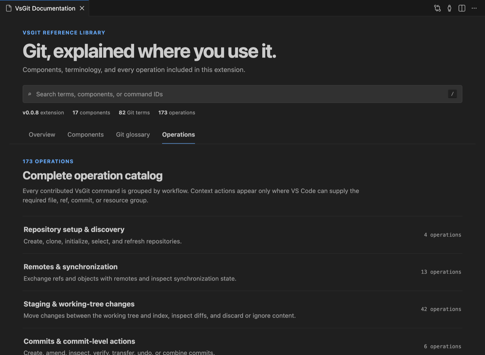<br/><sub>Operations</sub></td>
<td width="50%" valign="top">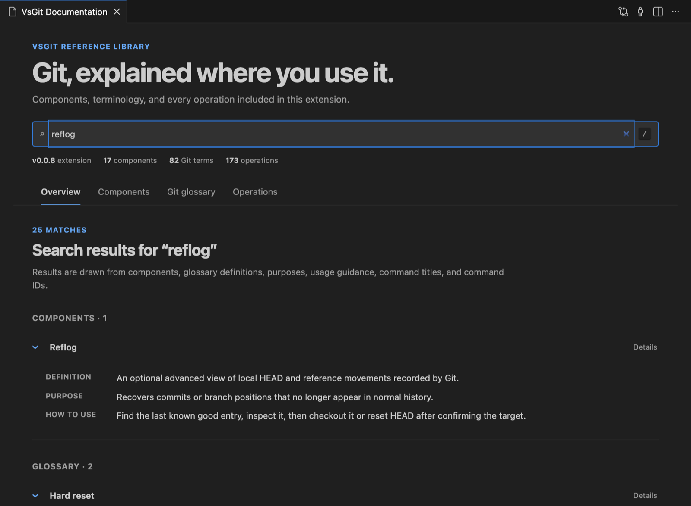<br/><sub>Search across everything</sub></td>
</tr>
</table>

---

## Common workflows

<details open>
<summary><b>Commit and push</b></summary>

1. Open the **Commit** view and review the *Changes* group (click a file for its
   diff).
2. Stage files with **+**, or use **Stage Hunk(s)…** in the Staging view for
   partial staging.
3. Type a message and press `Ctrl/Cmd+Enter`, or choose **Commit & Push** /
   **Commit & Sync** from the split button.
4. Need a DCO trailer or a signature? Open **…** and tick **Sign off** or
   **GPG**, or set `vsgit.commit.signOff` / `vsgit.commit.gpgSign`.

</details>

<details>
<summary><b>Catch up with the remote</b></summary>

1. **VsGit: Fetch** (`⌘⇧G F`) — or enable `vsgit.autoFetch.enabled`.
2. The Repositories view and the graph toolbar show ahead/behind counts.
3. Inspect incoming commits in **Synchronize**, or look for the remote pills in
   the Git Graph.
4. **VsGit: Pull…** merges or rebases, following `vsgit.defaultPullMode`.

</details>

<details>
<summary><b>Review a branch before merging</b></summary>

1. **VsGit: Start Branch/Tag Comparison…** → pick the target, then the branch.
2. The **Compare** view lists commits unique to each side and the changed files.
3. Or `Ctrl/Cmd`-click two commits in the Git Graph to see every change between
   them.
4. Merge with **Merge…** on the branch, or **Merge into Current Branch…** in the
   graph.

</details>

<details>
<summary><b>Resolve a merge conflict</b></summary>

1. When a merge, rebase, cherry-pick, or revert stops, the **Conflicts** view
   and the graph's in-progress banner appear.
2. For each file choose **Use Ours**, **Use Theirs**, or **Open Merge Editor**.
3. Save the result, then **Mark Resolved** to stage it.
4. Press **Continue** in the banner, the view title, or **In Progress**. **Abort**
   returns to where you started.

</details>

<details>
<summary><b>Clean up history before opening a pull request</b></summary>

1. **Interactive Rebase…** on your branch, or **VsGit: Interactive Rebase…** →
   *Rebase last N commits*.
2. Mark fix-up commits as **fixup** or **squash**, reorder with ↑ / ↓, and
   **reword** unclear messages.
3. **Start Rebase**. If it stops on a conflict, resolve it as above.
4. Push with **Push…** and tick **Force with lease** — VsGit asks for
   confirmation before any force push.

</details>

<details>
<summary><b>Tag and publish a release</b></summary>

1. Select the release commit in the Git Graph → **Create Tag Here…**.
2. Enter `v1.2.0`, tick **Annotated Tag**, add a message, and tick **Push tag
   after creation**.
3. Optionally **VsGit: Create Archive from Ref…** for a zip/tar of that tag.

</details>

<details>
<summary><b>Work on two branches at once</b></summary>

1. **VsGit: Add Worktree…** → choose an existing branch or create a new one,
   then pick a folder for the worktree.
2. **Open Worktree in New Window** from the Worktrees view.
3. When done, **Remove Worktree…**, then **Prune Worktrees** to clean up stale
   entries.

</details>

<details>
<summary><b>Recover a lost commit</b></summary>

1. Open the **Reflog** view — every `HEAD` movement is listed, newest first.
2. Find the entry from before the reset, rebase, or branch deletion.
3. **Checkout This Entry** to inspect it, then create a branch from the graph —
   or **Reset HEAD to Entry…** to move your branch back.

</details>

<details>
<summary><b>Find the commit that introduced a bug</b></summary>

1. Open the repository's **Bisect** submenu and choose **Start…**.
2. **Mark Bad** (leave the SHA empty for the current `HEAD`), then **Mark Good**
   with the SHA of a commit you know worked. Git checks out a commit halfway
   between them.
3. Test it, then **Mark Good** or **Mark Bad**; repeat until Git names the first
   bad commit.
4. **Show Log** keeps a record of the session and **Reset** returns to your
   branch.

</details>

<details>
<summary><b>Gerrit code review</b></summary>

1. **VsGit: Install Change-Id Hook** once per clone (it refuses to overwrite an
   existing hook).
2. Commit as usual; each commit gets a `Change-Id` footer.
3. **VsGit: Push for Review…** pushes to `refs/for/<branch>`.

</details>

---

## Advanced operations

| Feature | What you get |
|---|---|
| **Interactive Rebase** | Form-based todo editor with pick / reword / edit / squash / fixup / drop and reordering, edited entirely inside VS Code |
| **Worktrees** | Create, open, lock, unlock, move, remove, prune |
| **Git LFS** | Track, untrack, lock, unlock, list locks, pull, prune |
| **Git Notes** | Add, edit, remove, show per-commit notes |
| **Bisect** | Start, mark good/bad, reset, show log |
| **Subtree** | Add, pull, push, split |
| **Submodules** | Add, init, update, sync |
| **Archive** | Create a zip/tar from any ref |
| **Patch** | Create from staged changes or commits, and apply patch files |
| **Gerrit** | Push for review, install the `Change-Id` commit-msg hook |
| **Maintenance** | `git gc`, prune, fsck, and repo maintenance helpers |
| **Blame** | Toggleable inline blame annotations (`⌘⇧G A`) |
| **Tags** | Webview **Create Tag** dialog — name, message, and annotate / sign / force / push options in one form |
| **GitHub** | Fetch Pull Requests — pulls `refs/pull/*/head` as local refs |
| **Stash** | Save, apply, pop, drop, inspect, branch from, and clear stashes |
| **Remotes** | Add, remove, rename, edit URL, prune |
| **Git Config editor** | A graphical editor (`⌘⇧G ,`) for local / global / system git config |
| **Command preview** | With `vsgit.showCommandPreview`, see the exact `git` command before any mutating operation runs |

Interactive rebase and commit-message editing are routed back into VS Code via a
small editor shim wired to `GIT_SEQUENCE_EDITOR` / `GIT_EDITOR`, so `git rebase
-i` opens a native editor instead of a terminal `vi` session.

---

## Command reference

VsGit contributes 173 operations. 72 are available from the Command Palette
(type **VsGit**); the rest are context actions that need a selected file, ref,
commit, resource group, or view item, and appear on the matching right-click
menu. Expand a group to see its operations (this list is generated from the
extension manifest, using the same grouping as the built-in Documentation
library).

<details>
<summary><b>Repository setup & discovery</b> — 4 operations (4 in the Command Palette)</summary>

Create, clone, initialize, select, and refresh repositories. Start here when bringing a project under Git or choosing the active repository.

| Operation | Command ID | Where |
|---|---|---|
| Clone Repository... | `vsgit.clone` | Palette |
| Initialize Repository... | `vsgit.init` | Palette |
| Open Documentation | `vsgit.documentation.open` | Palette |
| Refresh | `vsgit.repositories.refresh` | Palette |

</details>

<details>
<summary><b>Remotes & synchronization</b> — 13 operations (8 in the Command Palette)</summary>

Exchange refs and objects with remotes and inspect synchronization state. Fetch first when you only need remote awareness; pull integrates; push publishes. **Caution:** Push, remote removal, and cleaning stale refs can affect shared workflows.

| Operation | Command ID | Where |
|---|---|---|
| Add Remote... | `vsgit.remote.add` | Palette |
| Checkout Commit (Detached) | `vsgit.sync.checkoutCommit` | Context menu |
| Cherry-Pick Commit | `vsgit.sync.cherryPick` | Context menu |
| Edit Remote... | `vsgit.remote.edit` | Context menu |
| Fetch (`⌘⇧G F`) | `vsgit.fetch` | Palette |
| Fetch All Remotes Now | `vsgit.autoFetch.fetchNow` | Palette |
| Fetch GitHub Pull Requests... | `vsgit.fetchGithubPrs` | Palette |
| Prune Stale Tracking Refs | `vsgit.remote.prune` | Palette |
| Pull... | `vsgit.pull` | Palette |
| Push... (`⌘⇧G P`) | `vsgit.push` | Palette |
| Refresh | `vsgit.sync.refresh` | Palette |
| Remove Remote | `vsgit.remote.remove` | Context menu |
| Show Commit Details | `vsgit.sync.showCommitDetails` | Context menu |

</details>

<details>
<summary><b>Staging & working-tree changes</b> — 42 operations (6 in the Command Palette)</summary>

Move changes between the working tree and index, inspect diffs, and discard or ignore content. Review a diff, stage the intended files or hunks, and verify the index before committing. **Caution:** Discard, delete, clean, and replace operations can remove local work.

| Operation | Command ID | Where |
|---|---|---|
| Add to .gitignore | `vsgit.staging.addToGitignore` | Context menu |
| Add to .gitignore | `vsgit.file.ignore` | Context menu |
| Amend Last Commit... | `vsgit.staging.commitAmend` | Palette |
| Assume Unchanged | `vsgit.file.assumeUnchanged` | Context menu |
| Blame | `vsgit.scm.blame` | Context menu |
| Branch, Tag, or Reference... | `vsgit.replace.withRef` | Context menu |
| Branch, Tag, or Reference... | `vsgit.replace.withBranchOrTag` | Context menu |
| Clean Untracked Files... | `vsgit.clean` | Palette |
| Commit... (`⌘⇧G C`) | `vsgit.staging.commit` | Palette |
| Commit... | `vsgit.replace.withCommit` | Context menu |
| Delete (git rm) | `vsgit.scm.delete` | Context menu |
| Discard All Changes | `vsgit.scm.discardAll` | Context menu |
| Discard Changes | `vsgit.staging.discard` | Context menu |
| Discard Changes | `vsgit.scm.discard` | Context menu |
| HEAD Revision | `vsgit.replace.withHead` | Context menu |
| Index Revision | `vsgit.replace.withIndex` | Context menu |
| Local History... | `vsgit.replace.withLocalHistory` | Context menu |
| No Assume Unchanged | `vsgit.file.noAssumeUnchanged` | Context menu |
| No Skip Worktree | `vsgit.file.noSkipWorktree` | Context menu |
| Open Diff | `vsgit.staging.openDiff` | Context menu |
| Open Diff | `vsgit.scm.openDiff` | Context menu |
| Open File | `vsgit.scm.openFile` | Context menu |
| Previous Revision | `vsgit.replace.withPrevious` | Context menu |
| Refresh | `vsgit.staging.refresh` | Palette |
| Rename / Move... | `vsgit.scm.rename` | Context menu |
| Replace with HEAD | `vsgit.scm.replaceWithHead` | Context menu |
| Show File History | `vsgit.file.showHistory` | Context menu |
| Show History | `vsgit.scm.showHistory` | Context menu |
| Skip Worktree | `vsgit.file.skipWorktree` | Context menu |
| Stage | `vsgit.staging.stage` | Context menu |
| Stage | `vsgit.file.stage` | Context menu |
| Stage All | `vsgit.staging.stageAll` | Palette |
| Stage All Changes | `vsgit.scm.stageAll` | Context menu |
| Stage Changes | `vsgit.scm.stage` | Context menu |
| Stage Hunk(s)... | `vsgit.staging.stageHunk` | Context menu |
| Unstage | `vsgit.staging.unstage` | Context menu |
| Unstage | `vsgit.file.unstage` | Context menu |
| Unstage All | `vsgit.staging.unstageAll` | Palette |
| Unstage All Changes | `vsgit.scm.unstageAll` | Context menu |
| Unstage Changes | `vsgit.scm.unstage` | Context menu |
| Unstage Hunk(s)... | `vsgit.staging.unstageHunk` | Context menu |
| Untrack (Remove from Index) | `vsgit.file.untrack` | Context menu |

</details>

<details>
<summary><b>Commits & commit-level actions</b> — 6 operations (5 in the Command Palette)</summary>

Create, amend, inspect, verify, transfer, undo, or combine commits. Use immutable follow-up operations such as revert for shared history; rewrite only local history. **Caution:** Amend, squash, and some cherry-pick workflows create new commit IDs.

| Operation | Command ID | Where |
|---|---|---|
| Branches/Tags Containing Commit... | `vsgit.commit.showContaining` | Palette |
| Cherry Pick... (`⌘⇧G K`) | `vsgit.commit.cherryPick` | Palette |
| Revert Commit... | `vsgit.commit.revert` | Palette |
| Show Commit Details | `vsgit.showCommitDetails` | Context menu |
| Squash Commits... | `vsgit.commit.squash` | Palette |
| Verify GPG Signature... | `vsgit.commit.verifyGpg` | Palette |

</details>

<details>
<summary><b>Branches & tags</b> — 16 operations (2 in the Command Palette)</summary>

Create and manage movable branches, remote-tracking branches, upstreams, and release tags. Choose a ref in the repository tree or graph, then use its context actions. **Caution:** Deleting refs or force-replacing tags can make commits harder to find.

| Operation | Command ID | Where |
|---|---|---|
| Checkout | `vsgit.branch.checkout` | Context menu |
| Checkout Remote Branch... | `vsgit.remoteBranch.checkout` | Context menu |
| Checkout Tag | `vsgit.tag.checkout` | Context menu |
| Compare Branch with... | `vsgit.branch.compareTo` | Context menu |
| Configure Upstream... | `vsgit.branch.configureUpstream` | Context menu |
| Create Branch... | `vsgit.branch.create` | Context menu |
| Create Tag... | `vsgit.tag.create` | Palette |
| Delete Branch... | `vsgit.branch.delete` | Context menu |
| Delete Remote Branch... | `vsgit.remoteBranch.delete` | Context menu |
| Delete Remote Tag... | `vsgit.tag.deleteRemote` | Context menu |
| Delete Tag | `vsgit.tag.delete` | Context menu |
| Force Re-tag... | `vsgit.tag.forceCreate` | Context menu |
| Push Tag... | `vsgit.tag.push` | Context menu |
| Rename Branch... | `vsgit.branch.rename` | Context menu |
| Reset HEAD... | `vsgit.branch.reset` | Context menu |
| Switch To Branch/Tag... (`⌘⇧G B`) | `vsgit.switchTo` | Palette |

</details>

<details>
<summary><b>History, graph & comparison</b> — 22 operations (10 in the Command Palette)</summary>

Explore ancestry, search commits, compare refs or files, inspect reflog entries, and attribute lines. Open Graph for repository topology, History for focused logs, and Compare for two-ref differences.

| Operation | Command ID | Where |
|---|---|---|
| Branch, Tag, or Reference... | `vsgit.compare.withBranchOrTag` | Context menu |
| Checkout This Entry | `vsgit.reflog.checkout` | Context menu |
| Clear Comparison | `vsgit.compare.clear` | Palette |
| Clipboard | `vsgit.compare.withClipboard` | Context menu |
| Commit... | `vsgit.compare.withCommit` | Context menu |
| Compare Branches... | `vsgit.history.compareBranches` | Palette |
| Compare File with Ref... | `vsgit.compare.withRef` | Palette |
| Each Other... | `vsgit.compare.eachOther` | Context menu |
| Filter History by Branch... | `vsgit.history.filterByBranch` | Palette |
| HEAD Revision | `vsgit.compare.withHead` | Context menu |
| Index (Staged) | `vsgit.compare.withIndex` | Context menu |
| Index with HEAD | `vsgit.compare.indexWithHead` | Context menu |
| Local History... | `vsgit.compare.withLocalHistory` | Context menu |
| Open Diff | `vsgit.compare.openDiff` | Context menu |
| Previous Revision | `vsgit.compare.withPrevious` | Context menu |
| Refresh | `vsgit.reflog.refresh` | Palette |
| Reset HEAD to Entry... | `vsgit.reflog.reset` | Context menu |
| Show Git Graph (`⌘⇧G G`) | `vsgit.graph.show` | Palette |
| Show History (`⌘⇧G L`) | `vsgit.history.show` | Palette |
| Start Branch/Tag Comparison... | `vsgit.compare.start` | Palette |
| Switch Comparison Sides | `vsgit.compare.switchSides` | Palette |
| Toggle Inline Blame (`⌘⇧G A`) | `vsgit.blame.toggle` | Palette |

</details>

<details>
<summary><b>Merge, rebase & conflicts</b> — 13 operations (8 in the Command Palette)</summary>

Integrate histories and complete or abort in-progress sequencer operations. Inspect source and target refs, integrate, resolve every conflict, stage resolutions, then continue. **Caution:** Rebase rewrites commit IDs; abort or reflog can recover an unwanted result.

| Operation | Command ID | Where |
|---|---|---|
| Abort | `vsgit.rebase.abort` | Palette |
| Abort Merge | `vsgit.merge.abort` | Palette |
| Continue | `vsgit.rebase.continue` | Palette |
| Interactive Rebase... | `vsgit.rebase.interactive` | Palette |
| Mark Resolved | `vsgit.conflict.markResolved` | Context menu |
| Merge... | `vsgit.merge` | Palette |
| Open Merge Editor | `vsgit.conflict.openMergeEditor` | Context menu |
| Open Merge Tool... | `vsgit.mergeTool` | Palette |
| Rebase... | `vsgit.rebase` | Palette |
| Show Rebase/Merge Progress... | `vsgit.rebase.showProgress` | Context menu |
| Skip | `vsgit.rebase.skip` | Palette |
| Use Ours | `vsgit.conflict.useOurs` | Context menu |
| Use Theirs | `vsgit.conflict.useTheirs` | Context menu |

</details>

<details>
<summary><b>Stashes</b> — 7 operations (2 in the Command Palette)</summary>

Temporarily save unfinished index and working-tree changes outside branch history. Create a stash before switching tasks, inspect it, then apply, pop, or create a branch from it. **Caution:** Dropping or clearing stashes removes their normal recovery entry.

| Operation | Command ID | Where |
|---|---|---|
| Apply Stash | `vsgit.stash.apply` | Context menu |
| Clear All Stashes | `vsgit.stash.clearAll` | Palette |
| Create Branch from Stash... | `vsgit.stash.branch` | Context menu |
| Drop Stash | `vsgit.stash.drop` | Context menu |
| Pop Stash | `vsgit.stash.pop` | Context menu |
| Stash Changes... | `vsgit.stash.create` | Palette |
| View Stash Contents | `vsgit.stash.view` | Context menu |

</details>

<details>
<summary><b>Worktrees</b> — 9 operations (4 in the Command Palette)</summary>

Manage multiple linked working directories for one repository. Create a worktree per simultaneous branch task and remove it after the work is integrated. **Caution:** Removing a worktree with uncommitted changes can lose work.

| Operation | Command ID | Where |
|---|---|---|
| Add Worktree... | `vsgit.worktree.create` | Palette |
| Lock Worktree... | `vsgit.worktree.lock` | Palette |
| Move Worktree... | `vsgit.worktree.move` | Context menu |
| Open Worktree Here | `vsgit.worktree.openHere` | Context menu |
| Open Worktree in New Window | `vsgit.worktree.open` | Context menu |
| Prune Worktrees | `vsgit.worktree.prune` | Palette |
| Remove Worktree... | `vsgit.worktree.remove` | Context menu |
| Reveal in Explorer | `vsgit.worktree.revealInExplorer` | Context menu |
| Unlock Worktree | `vsgit.worktree.unlock` | Palette |

</details>

<details>
<summary><b>Recovery, diagnosis & maintenance</b> — 13 operations (9 in the Command Palette)</summary>

Find regressions, reset repository state, inspect integrity, and optimize object storage. Prefer read-only logs and checks first; capture a recovery ref before destructive maintenance. **Caution:** Hard reset, prune, and aggressive maintenance can discard recoverable state.

| Operation | Command ID | Where |
|---|---|---|
| Check Integrity (fsck) | `vsgit.maintenance.fsck` | Palette |
| Garbage Collect... | `vsgit.maintenance.gc` | Palette |
| Hard (reset index & working tree)... | `vsgit.repo.reset.hard` | Palette |
| Keep (reset index, keep local changes)... | `vsgit.repo.reset.keep` | Palette |
| Mark Bad | `vsgit.bisect.bad` | Context menu |
| Mark Good | `vsgit.bisect.good` | Context menu |
| Merge (reset index, keep merge changes)... | `vsgit.repo.reset.merge` | Palette |
| Mixed (reset index, keep working tree)... | `vsgit.repo.reset.mixed` | Palette |
| Prune Unreachable Objects... | `vsgit.maintenance.prune` | Palette |
| Reset | `vsgit.bisect.reset` | Context menu |
| Show Log | `vsgit.bisect.log` | Context menu |
| Soft (keep index & working tree)... | `vsgit.repo.reset.soft` | Palette |
| Start... | `vsgit.bisect.start` | Palette |

</details>

<details>
<summary><b>Patches & archives</b> — 4 operations (4 in the Command Palette)</summary>

Export changes or tracked snapshots to files and apply portable patches. Use patches for change exchange and archives for history-free release artifacts. **Caution:** Review patch contents and paths before applying files from another source.

| Operation | Command ID | Where |
|---|---|---|
| Apply Patch... | `vsgit.patch.apply` | Palette |
| Create Archive from Ref... | `vsgit.archive.create` | Palette |
| Create Patch from Commits... | `vsgit.patch.createFromCommits` | Palette |
| Create Patch from Staged Changes... | `vsgit.patch.createFromStaged` | Palette |

</details>

<details>
<summary><b>LFS, submodules & subtrees</b> — 16 operations (4 in the Command Palette)</summary>

Manage large-file storage and repositories composed from other repositories. Choose the model that matches the project, then commit its metadata alongside content changes. **Caution:** These workflows may require extra tools, server support, or coordinated remote configuration.

| Operation | Command ID | Where |
|---|---|---|
| Add Submodule... | `vsgit.submodule.add` | Palette |
| Add Subtree... | `vsgit.subtree.add` | Palette |
| Init Submodule(s) | `vsgit.submodule.init` | Context menu |
| Lock File... | `vsgit.lfs.lock` | Context menu |
| Prune Old Objects | `vsgit.lfs.prune` | Context menu |
| Pull Objects | `vsgit.lfs.pull` | Context menu |
| Pull Updates... | `vsgit.subtree.pull` | Context menu |
| Push Changes... | `vsgit.subtree.push` | Context menu |
| Show Locks | `vsgit.lfs.locks` | Context menu |
| Show Tracked Files | `vsgit.lfs.info` | Palette |
| Split into Separate History... | `vsgit.subtree.split` | Context menu |
| Sync Submodule(s) | `vsgit.submodule.sync` | Context menu |
| Track Pattern... | `vsgit.lfs.track` | Palette |
| Unlock File... | `vsgit.lfs.unlock` | Context menu |
| Untrack Pattern... | `vsgit.lfs.untrack` | Context menu |
| Update Submodule(s) | `vsgit.submodule.update` | Context menu |

</details>

<details>
<summary><b>Notes & Gerrit</b> — 6 operations (4 in the Command Palette)</summary>

Attach metadata to commits and publish Gerrit review changes. Use notes for separate metadata and Gerrit Change-Ids for review patch-set continuity.

| Operation | Command ID | Where |
|---|---|---|
| Add Note to Commit... | `vsgit.notes.add` | Palette |
| Edit Note... | `vsgit.notes.edit` | Context menu |
| Install Change-Id Hook | `vsgit.gerrit.installHook` | Palette |
| Push for Review... | `vsgit.gerrit.pushForReview` | Palette |
| Remove Note... | `vsgit.notes.remove` | Context menu |
| Show Note... | `vsgit.notes.show` | Palette |

</details>

<details>
<summary><b>Configuration</b> — 2 operations (2 in the Command Palette)</summary>

Inspect or edit Git configuration at local, global, and system scopes. Prefer local scope for repository-specific policy and global scope for personal defaults. **Caution:** Configuration can change authentication, signing, transport, merge, and hook behavior.

| Operation | Command ID | Where |
|---|---|---|
| Edit Config... | `vsgit.config.open` | Palette |
| Open Git Config Panel... (`⌘⇧G ,`) | `vsgit.config.openPanel` | Palette |

</details>

---

## Keyboard shortcuts

| macOS | Windows / Linux | Command |
|---|---|---|
| `⌘⇧G C` | `Ctrl+Shift+G C` | Commit |
| `⌘⇧G P` | `Ctrl+Shift+G P` | Push |
| `⌘⇧G L` | `Ctrl+Shift+G L` | Show History |
| `⌘⇧G F` | `Ctrl+Shift+G F` | Fetch |
| `⌘⇧G B` | `Ctrl+Shift+G B` | Switch To Branch/Tag |
| `⌘⇧G A` | `Ctrl+Shift+G A` | Toggle Inline Blame |
| `⌘⇧G G` | `Ctrl+Shift+G G` | Show Git Graph |
| `⌘⇧G K` | `Ctrl+Shift+G K` | Cherry-Pick Commit |
| `⌘⇧G ,` | `Ctrl+Shift+G ,` | Open Git Config Panel |

The shortcuts are chords: press `⌘⇧G` / `Ctrl+Shift+G`, release, then press the
letter. Inside the Commit view, `Ctrl/Cmd+Enter` commits; inside the Git Graph,
see the [interaction table](#git-graph).

The Command Palette exposes **72** commands under the **VsGit** category. The
other **101** contributed operations are intentionally context-only because they
require a selected file, ref, commit, resource group, or view item. The
Documentation library covers all **173** and identifies each entry point.

---

## Settings reference

All 29 settings live under the `vsgit.*` namespace.

### General

| Setting | Default | Description |
|---|---|---|
| `vsgit.showAdvancedViews` | `false` | Show advanced sidebar sections (Staging, Reflog, Synchronize, Worktrees, Conflicts, Compare). |
| `vsgit.git.path` | `""` | Custom path to the `git` executable; empty uses `$PATH`. |
| `vsgit.autoRefresh` | `true` | Refresh views automatically when the repo changes. |
| `vsgit.confirmDestructiveActions` | `true` | Confirm hard reset, clean, force-push, etc. |
| `vsgit.showCommandPreview` | `false` | Preview mutating git commands before execution; read-only refresh/diff commands run without prompting. |
| `vsgit.defaultPullMode` | `merge` | Pull strategy: `merge` or `rebase`. |

### Fetch & sync

| Setting | Default | Description |
|---|---|---|
| `vsgit.autoFetch.enabled` | `false` | Periodically fetch from all remotes. |
| `vsgit.autoFetch.intervalMinutes` | `3` | Minutes between automatic fetches. |
| `vsgit.autoFetch.notify` | `true` | Notify when auto-fetch discovers new incoming commits. |
| `vsgit.fetch.pruneOnFetch` | `true` | Prune deleted remote-tracking branches on fetch. |

### Commit & blame

| Setting | Default | Description |
|---|---|---|
| `vsgit.commit.gpgSign` | `false` | Sign commits with GPG by default (`-S`). |
| `vsgit.commit.signOff` | `false` | Add a `Signed-off-by` trailer by default (DCO). |
| `vsgit.blame.enabledByDefault` | `false` | Show inline blame when opening files. |

### History & graph

| Setting | Default | Description |
|---|---|---|
| `vsgit.history.maxCommits` | `500` | Max commits to load in the History view. |
| `vsgit.graph.pageSize` | `200` | Commits loaded per page in the History view. |
| `vsgit.graph.maxCommits` | `500` | Max commits to load in the Git Graph. |
| `vsgit.graph.sortOrder` | `date` | Commit sort order for the History view (`date` / `author-date` / `topo`). |
| `vsgit.graph.style` | `rounded` | Branch line style: `rounded` curves or `angular` elbows. |
| `vsgit.graph.colours` | 12-colour palette | Branch lane colours cycled through in the graph. |
| `vsgit.graph.dateFormat` | `standard` | Date format in the graph (`relative` / `iso` / `standard`). |
| `vsgit.graph.showRemoteBranches` | `true` | Show remote branches in the graph by default. |
| `vsgit.graph.showSidebar` | `true` | Show the graph's left sidebar tree. |
| `vsgit.graph.showStatusBarItem` | `true` | Show a *Git Graph* button in the status bar. |
| `vsgit.graph.bottomPanelMode` | `editor` | How the graph opens a changed file's diff (`editor` / `inline`). |
| `vsgit.graph.showIdColumn` | `true` | Show the Id (hash) column. |
| `vsgit.graph.showAuthorColumn` | `true` | Show the Author column. |
| `vsgit.graph.showAuthoredDateColumn` | `false` | Show the Authored Date column. |
| `vsgit.graph.showCommitterColumn` | `false` | Show the Committer column. |
| `vsgit.graph.showCommittedDateColumn` | `true` | Show the Committed Date column. |

There's also a graphical **Git Config editor** (`⌘⇧G ,`) for editing local /
global / system git config, and a Remotes manager.

<details>
<summary><b>Example <code>settings.json</code></b></summary>

```jsonc
{
  // Show Staging, Reflog, Synchronize, Worktrees, Conflicts, and Compare
  "vsgit.showAdvancedViews": true,

  // Keep incoming changes current and prune deleted remote branches
  "vsgit.autoFetch.enabled": true,
  "vsgit.autoFetch.intervalMinutes": 5,
  "vsgit.fetch.pruneOnFetch": true,

  // Rebase instead of merge on pull; always add a DCO trailer
  "vsgit.defaultPullMode": "rebase",
  "vsgit.commit.signOff": true,

  // Graph appearance
  "vsgit.graph.style": "angular",
  "vsgit.graph.dateFormat": "relative",
  "vsgit.graph.showCommitterColumn": true,

  // See each mutating git command before it runs
  "vsgit.showCommandPreview": true
}
```

</details>

---

## File & language icons

VsGit uses **official VS Code codicons** for every UI glyph (toolbar buttons, ref
pills, tree chevrons, actions) — there are no hand-drawn or third-party SVG icons
in the interface.

For changed-file rows in the Commit and Graph panels, VsGit shows the same
**Seti file-type icons** that VS Code's default File Icon Theme renders in the
Explorer (colourful, language-specific icons for JS/TS/JSON/Python/etc.).

> **Why bundle the icons?** Webviews can't read the user's active File Icon Theme
> ([microsoft/vscode#183893](https://github.com/microsoft/vscode/issues/183893)).
> VsGit therefore bundles the Seti icon font and a filename→icon mapping
> generated from VS Code's own `theme-seti` source — the same approach GitLens
> uses. The icons match stock VS Code; they won't follow a *custom* third-party
> icon theme.

---

## What's included and what's next

### Added and available now

- A **Documentation** view at the bottom of the VsGit sidebar.
- A full-screen **VsGit: Open Documentation** command, also available from the
  Documentation view title and its **Open Full Library** button.
- Detailed component guides covering Repositories, Commit, Staging, Graph,
  History, Compare, Synchronize, Conflicts, Reflog, Worktrees, native Source
  Control integration, configuration, blame, and background services.
- A searchable Git glossary with definitions, purpose, practical usage, and
  cautions for destructive or history-rewriting concepts.
- A manifest-driven catalog of all **173 contributed operations**. It clearly
  separates the **72 Command Palette operations** from **101 contextual actions**
  that require a selected file, ref, commit, resource group, or view item.
- The existing Git client surface: multi-root repositories, staging and commit,
  branch/tag/remote workflows, history and graph, synchronization, conflict
  resolution, worktrees, LFS, Gerrit, notes, patch/archive, submodules,
  subtrees, bisect, maintenance, config editing, and authenticated Git IPC.
- Phase 10 integration and polish: keyboard and screen-reader semantics across
  tree/webview surfaces, forced-colour support, concurrent/coalesced repository
  discovery, lazy submodule loading, Extension Host tests, enforceable coverage,
  audited development dependencies, CI release gates, and inspected VSIX output.
- Real screenshots of the current build throughout this README.

### Pending future enhancements

- Multi-platform Extension Host runs beyond the current macOS development and
  Ubuntu CI coverage.
- Larger synthetic-repository benchmarks and additional on-demand loading for
  rarely used metadata.
- Localization of the documentation library and command descriptions.
- Animated workflow recordings for the Marketplace listing.
- Signed release provenance and automated post-publish Marketplace smoke tests.

The detailed engineering status remains in
[docs/IMPLEMENTATION_PLAN.md](docs/IMPLEMENTATION_PLAN.md). Pending items above
are plans, not claims of implemented behavior.

---

## Architecture

```
src/
  extension.ts            activation: registers commands, views, providers
  git/
    GitExecutor.ts        the ONLY place git is spawned (argv array, no shell)
    Repository.ts         per-repo cached state + all git operations
    RepositoryManager.ts  multi-root discovery + change notifications
    GitContentProvider.ts vsgit: URIs that feed VS Code's diff editor
    QuickDiffProvider.ts  gutter quick-diff against the index
    argGuard.ts           option-injection guards (safeRef / safeRemoteUrl)
    parsers/              pure, unit-tested output parsers
                          (log, graphLog, status, refs, diff, blame, config,
                           reflog, rebaseTodo, worktree)
  commands/               one module per workflow (branch, stash, tag, lfs,
                          notes, bisect, subtree, rebase, gerrit, …)
  decorations/            inline blame + Explorer file decorations
  views/                  tree data providers + native Source Control bridge
  webviews/               webview panels (Graph, History, Commit, Documentation,
                          Create Tag, Config, Interactive Rebase, ref/commit
                          pickers)
  services/               auto-fetch, file-system watcher, status bar
  util/                   IPC servers (askpass / editor), credential/editor
                          plumbing, and shared helpers (HTML escaping, crypto
                          token/nonce generation, command preview, confirmation)
resources/                images only (icon.png/.svg, activity-bar logo)
docs/images/              README screenshots (not shipped in the .vsix)
webview-ui/               webview runtime assets, shipped in the .vsix
  graph/
    graph.js / graph.css   Git Graph panel client
    graphLayout.js          shared, unit-tested commit-graph layout (UMD)
  commit/
    commit.js / commit.css  Commit webview client
    commitView.js           Commit view pure helpers (UMD, unit-tested)
  documentation/
    documentation.js/.css   searchable documentation library client
  shared/
    setiIcons.js            shared filename→Seti-icon resolver (UMD)
    seti.css / seti.woff    bundled Seti file-icon font (Explorer icons)
    codicon.css / codicon.ttf  bundled VS Code codicon font (UI glyphs)
    askpass.js              GIT_ASKPASS shim
    sequence-editor.js      GIT_SEQUENCE_EDITOR / GIT_EDITOR shim
```

Key design points:

- **One spawn site.** Every git call funnels through `GitExecutor`, which uses
  `child_process.spawn(gitPath, args)` with an argv array — never a shell string.
- **Machine-readable output.** Operations request NUL-/porcelain-formatted output
  and parse it in small, pure functions under `git/parsers/`, each with tests.
- **One graph layout.** The Git Graph panel imports
  `webview-ui/graph/graphLayout.js` (a UMD module that also loads in Node), so
  there is a single, verified implementation of lane layout and edge geometry.
- **Shared webview helpers.** Pure logic (status labels, file-tree grouping,
  HTML-escaping, Seti icon resolution) lives in UMD modules so it can be unit
  tested in Node and reused across the Commit and Graph webviews.
- **Live refresh.** A file-system watcher plus `RepositoryManager.onDidChange`
  keep every view in sync after internal or external git changes.
- **Measured, coalesced discovery.** Workspace roots are discovered concurrently;
  overlapping scans share one in-flight operation, scan duration is recorded,
  and submodule enumeration is deferred until its tree is opened.

---

## Security model

- **No shell.** Git is spawned with an argv array, so shell metacharacters
  (`;`, `|`, `$()`, backticks) are inert.
- **Option-injection guards.** Refs, SHAs, branch names, paths, and remote URLs
  coming from webview messages or rendered commit data are validated by
  `safeRef` / `safeRemoteUrl`: values beginning with `-` (which git would parse
  as options) are rejected, as are the `ext::` / `fd::` remote-helper transports
  that can run arbitrary commands. Commands without a `--` separator (e.g.
  `git worktree`, `git config`) keep flags before positional data so untrusted
  values can never land in option position.
- **Bounded git output.** `GitExecutor` caps the combined stdout/stderr it
  retains (64 MB by default) so a malformed or hostile repository cannot exhaust
  the extension host, and escalates a timed-out child from `SIGTERM` to
  `SIGKILL` if it ignores the first signal.
- **Authenticated IPC.** Credential prompts (`GIT_ASKPASS`) and rebase/commit
  editing run over a unix socket / named pipe whose name is enumerable by other
  local processes. Each session generates a random 256-bit token, passed to the
  shim only via its environment; the server rejects any connection that doesn't
  echo it (compared in constant time) — preventing local credential phishing or
  edit injection. On POSIX systems the socket file is additionally created with
  `0600` permissions, callers wait for the server to be listening before git is
  spawned, and the IPC read buffers are bounded. Credential prompts are masked
  unless they explicitly ask for a username.
- **Secret redaction.** Remote URLs are stripped of embedded user-info and
  common secret query parameters (`token`, `password`, `access_token`, `auth`)
  before they appear in clone progress, command previews, or the config editor,
  so credentials in a URL are never echoed back to the UI.
- **Validated webview messages.** The Git-config editor treats every inbound
  `postMessage` as untrusted: scope, key, value, and extension-setting fields are
  type- and range-checked against an allow-list before any `git config` write or
  `workspace.update`, so a crafted message cannot mutate arbitrary settings.
- **Hardened hook installation.** Installing the Gerrit `Change-Id` hook refuses
  to overwrite or follow an existing hook or symlink (`O_EXCL` create), so it
  cannot clobber custom policy or be redirected through a malicious link.
- **Strict webview CSP.** Each webview runs under a Content-Security-Policy that
  only allows the extension's own crypto-random nonce'd scripts and bundled
  styles/fonts.
- **Workspace trust boundary.** The manifest disables VsGit in untrusted and
  virtual workspaces because Git configuration and repository hooks execute from
  a local checkout.

---

## Development & testing

```bash
npm install
npm run watch        # esbuild in watch mode; F5 launches the dev host
npm run check-types  # tsc --noEmit
npm run build        # production bundle into dist/
npm test             # compile + run the unit-test suite
npm run test:coverage     # enforce 80% lines/branches and 70% functions
npm run test:integration  # launch a real VS Code Extension Host
npm run package:verify    # build and inspect artifacts/vsgit-vscode.vsix
npm run verify            # check-types + test + coverage + build
```

### Testing

Unit and contract tests run on Node's built-in test runner (`node --test`). They
cover the pure logic that's most worth pinning down:

- every output parser under `src/git/parsers/` (log, graph-log, status, refs,
  diff, blame, config, reflog, rebase-todo, worktree),
- the shared commit-graph layout (`webview-ui/graph/graphLayout.test.js`) and the
  Git Graph / Commit webview clients (`webview-ui/manifest.test.js`,
  `webview-ui/commit/commit.test.js`, `webview-ui/commit/commitView.test.js`),
- the Seti filename→icon resolver,
- the `GitExecutor` argv assembly and the `Repository` command builders,
- the argument guards, the HTML-escape helper, and the IPC token comparison,
- accessibility contracts for every tree provider and webview surface,
- Phase 10 CI, coverage, performance, documentation, and packaging contracts —
  including checks that this README's settings table and operation counts match
  the manifest.

```bash
npm test     # 196 tests
```

The Extension Host suite activates the real extension, verifies every
contributed command, refreshes repository discovery, and opens Documentation.
Native coverage currently exceeds the enforced 80% line, 80% branch, and 70%
function thresholds.

CI runs type-checking, unit/contract tests, coverage, a Linux Extension Host,
dependency audit, production build, and VSIX inspection on every push and pull
request. See [CONTRIBUTING.md](CONTRIBUTING.md) for development standards.

---

## Requirements

- VS Code **1.85+**
- `git` **2.20+** on `$PATH` (or set `vsgit.git.path`)
- `git-lfs` for the LFS commands (optional)
- A trusted local workspace (virtual and Restricted Mode workspaces are not
  supported because VsGit executes the repository's Git configuration/hooks)

---

## FAQ & troubleshooting

**VsGit can't find my repository.** VsGit discovers repos from your open
workspace folders. Make sure the folder containing `.git` is open, or run
**VsGit: Refresh**.

**Git isn't found / wrong version.** Set `vsgit.git.path` to the absolute path of
your `git` binary, then reload the window.

**The advanced views are missing.** Enable `vsgit.showAdvancedViews` to reveal
Staging, Reflog, Synchronize, Worktrees, Conflicts, and Compare.

**Commands act on the wrong repository.** In a multi-root workspace, click the
repository you want in the **Repositories** view; it becomes the *active*
repository that the other views and commands follow.

**Each repository appears twice in Source Control.** VS Code's built-in Git
extension is also active. Set `"git.enabled": false` if you want VsGit to be the
only provider.

**VsGit is disabled in this folder.** The workspace is in Restricted Mode.
Trust it (**Manage Workspace Trust**) — VsGit needs trust because Git runs the
repository's hooks and configuration.

**`git rebase -i` or `git commit` wants a terminal editor.** Start the rebase
from VsGit (**Interactive Rebase…**) so the editor shim is wired up; rebases
started in a terminal use your configured `core.editor`.

**I want to see what VsGit runs.** Enable `vsgit.showCommandPreview` to preview
every mutating `git` command before it executes.

**File icons look generic.** VsGit shows the default Seti icons; it cannot read a
custom File Icon Theme inside a webview (a VS Code platform limitation). The icons
will match a stock VS Code install.

**Credential prompts.** VsGit uses your existing git credential helper via
`GIT_ASKPASS`. If a remote needs auth, you'll get a native VS Code prompt.

---

## Contributing

Contributions are welcome. Please submit issues and enhancement requests through
the repository, and see [CONTRIBUTING.md](CONTRIBUTING.md) for the development
workflow.

## License

Licensed under the [MIT License](LICENSE).

## Links

- **Repository:** [framedparadox/vsgit-vscode](https://github.com/framedparadox/vsgit-vscode)
- **Issues:** [Report a bug](https://github.com/framedparadox/vsgit-vscode/issues)
- **Changelog:** [CHANGELOG.md](CHANGELOG.md)
- **Implementation plan:** [docs/IMPLEMENTATION_PLAN.md](docs/IMPLEMENTATION_PLAN.md)
